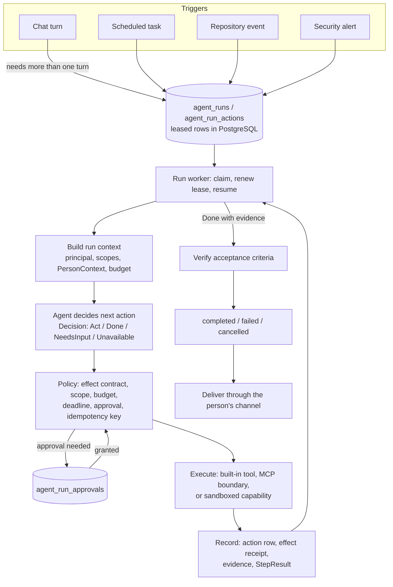

# From assistant to agent platform: the plan

Written 2026-09-04 against `c401aebc`, for a decision the operator has not
made yet. Nothing below Phase 1 is built. Inputs: the Codex architecture
review of 8116e7d, [ROUTER_ARCHITECTURE_OPTIONS.md](ROUTER_ARCHITECTURE_OPTIONS.md),
ADR [0012](adr/0012-the-graph-answers-the-turn-it-does-not-run-it.md),
[0018](adr/0018-an-outside-agent-enters-as-a-tool-or-not-at-all.md) and
[0023](adr/0023-the-router-keeps-a-catalogue-not-a-list.md), and the code.
Every claim about the code was checked by reading it or running it; the
file and line are given so the check can be repeated.

The goal, in one sentence: AniOS should be able to run an agent that
decides, acts, observes and decides again for as long as a job takes, under
someone's authority, surviving a restart, producing evidence that the job
is done, without weakening the one-boundary design that makes it safe to
own. A code-review agent and a security-investigation agent are the first
two customers of that runtime.

## 1. What was checked

Codex's findings, each against the current tree.

| Finding | Where | Status |
| --- | --- | --- |
| Later steps of the loop see only the automation tools | `conversation_service.py:3600` passes `only=AUTOMATION_TOOLS`; `_apply_step` (`:3636`) carries out task, skill and Scout actions and returns `None` for everything else | `VERIFIED` |
| Loop state is in-process only | `turn_steps.py:67-72`: a list, a `set` of `repr`s, a counter and a clock | `VERIFIED` |
| The deadline is not enforced after a decision | Budget 20 ms, decision 80 ms: the second action was applied at 81 ms (isolated probe, this date). The clock is read before `decide` (`turn_steps.py:91`) and never again before `apply` | `FAILED` |
| No-tool and routing failure are both `None` | `main_action_selector.py:696-698` returns `None` from a bare `except Exception`; `:441`, `:492`, `:713`, `:734` return `None` for legitimate no-tool cases | `VERIFIED` |
| Duplicate protection is `repr` plus one creation | `turn_steps.py:96-101`; `conversation_service.py:3608-3611`. `scheduled_task_runs` is unique per slot (`models/scheduled_task.py:93`) but `scheduled_tasks` has no dedupe key on create | `VERIFIED` |
| Routing cache keys tool names, not definitions | `_decision_key` (`main_action_selector.py:147-153`) hashes sorted names; MCP tools are offered as positional `mcp_tool_{index}` (`:545`) | `VERIFIED` |
| Trusted and read-only servers are both replay-safe | `mcp_invocation_service.py:24-28`, `_REPLAY_SAFE = _AUTO_INVOCABLE` | `VERIFIED` |
| MCP argument validation is shallow | `mcp/invocation.py:120-158`: required, unknown, top-level primitive type only | `VERIFIED` |
| Outbound screening skips non-strings | `mcp_invocation_service.py:80-84` passes any non-`str` through unread | `VERIFIED` |
| Ranking failure reads as on-subject | `result_ranking.py:74`, `:99` | `VERIFIED` |
| Pattern gates still decide meaning in two places | `_PLACE_BOUND` regex (`conversation_service.py:437`); episodic keyword gate (`memory/coordinator.py:117`) | `VERIFIED` |
| Personalisation is fragmented | compose sees `likes[:8]` (`conversation_service.py:2800`), interest judgement `likes[:40]` (`:2769`), ranking eight lines (`_known_for_ranking`, `:3283`), dispositions via a `ContextVar` (`:786`) | `VERIFIED` |
| `TURN_MAX_STEPS` ships at 1 | `settings.py:100`; `docker-compose.yml:273,696,845` | `VERIFIED` |
| `ConversationService` is over 5,000 lines | 5,590 lines | `VERIFIED` |
| No tenant or organisation concept | no `tenant`/`workspace`/`org` identifier anywhere in `backend/`; per-token scopes exist (`core/auth.py:22-60`) and an `is_admin` flag | `VERIFIED` |

What the review did not have in front of it, and what changes the plan:

- **Phase 1 is done.** `c401aebc` added the trajectory harness, six labelled
  trajectories and `evaluate_trajectories`. Measured baseline 10/18:
  single_step 3/3, reference 3/3, partial_failure 3/3, mixed_tools 1/6,
  multiple_writes 0/3. Those last two numbers are the review's two critical
  findings, measured. The floors are 0 until the repair moves them.
- **ADR 0012 decided the turn is not a graph, and why.** A streaming SSE
  consumer that disconnects stops every downstream node; ten of eleven
  persistence sites write before their final yield for that reason; and a
  resumed node re-executes from the top. So a durable run controller cannot
  live in the request path at all. It has to be a worker, which is the shape
  decks (`presentation-worker`) and scheduled tasks (`task_runner` in the
  discovery worker) already have.
- **ADR 0018 decided that an outside capability enters as an MCP tool or not
  at all.** A code-review agent's repository access and a security agent's
  scanners are outside capabilities. They enter behind the same invocation
  boundary, with a risk classification, or they do not enter.
- **`only=AUTOMATION_TOOLS` on later steps is a rule, not an oversight.**
  AGENTS.md: "restrict a later step in code, not in the prompt", because a
  second decision must not be able to start a ninety-second image job or
  spend a search credit. Lifting it needs a replacement that says, per tool,
  what a later step may do. That replacement is the centre of Phase 2.
- **The router's own reliability has a separate, measured plan.**
  `ROUTER_ARCHITECTURE_OPTIONS.md` (2026-09-03) records the flake rates and
  recommends rate assertions, a SetFit front classifier with a confidence
  cascade, then guided choice with voting. The review's execution
  architecture and that document's selection reliability are two axes; both
  are needed and neither mentions the other.
- **Durable machinery already exists and has survived production.** Leased
  run queues with exactly-once slots and lapsed-lease reclaim
  (`tasks/repository.py:421-496`, `discovery_worker.py:240`), a change log
  with undo (`tasks/repository.py:213-288`), a Redis model gate with
  foreground priority (`core/model_gate.py`), and a per-turn trace. The plan
  reuses these rather than importing a second runtime.
- **There is no hardware headroom for another stateful service or model.**
  The reply model is tensor-parallel across both Sparks; the vision model
  takes what is left on spark2. Anything new has to be a process on the
  existing Postgres and Redis.

## 2. What "enterprise ready" means for this system

Two readings exist and they lead to different work. One is a multi-tenant
service many organisations share. The other is a hardened deployment for one
organisation with many people in it, where every action is attributable,
authorised, bounded, auditable and recoverable. On two DGX Sparks serving one
operator's approved users, the second is the achievable target and the first
is not on this hardware. **This plan targets the second**, and carries a
`tenant_id` on every new table from the first migration so that the first
becomes a data migration later rather than a rewrite.

Concretely, the system is enterprise ready when each of these is measured
true rather than described:

1. Every effect on the world is attributable to a principal (the person) and
   an actor (the agent or channel acting for them), authorised at the moment
   of execution rather than at the moment of selection.
2. Every tool declares what it does to the world, and a retry, a replay, a
   restart or a second decision cannot cause an effect the declaration says
   is not safe to repeat.
3. A run survives a process restart without duplicating an effect or
   claiming success for one that did not happen.
4. Completion means evidence against acceptance criteria written before the
   work began; "the model named no further tool" is a stopping rule for a
   chat turn and nothing more.
5. A consequential action waits for an approval bound to that exact action,
   its arguments, its target and an expiry.
6. What a person is told about themselves, and what leaves the machine, are
   governed by one context object with provenance and egress flags, not by
   whichever code path happened to fetch it.
7. Untrusted text - a repository, a web page, an alert, a memory - is
   evidence and can never widen what an agent may do.
8. Behaviour has floors: trajectory completion, selection accuracy, duplicate
   effects, unauthorised actions, latency and cost are measured per category
   on every deploy, and a floor is set one miss below a measured value.
9. Backups restore, including runs that were in flight, and the drill is
   repeated.

## 3. The shape

Two loops share one set of types. The **chat turn** keeps the shape ADR 0012
gave it: `run_steps` in-process, bounded by steps and a wall clock, stopping
when the router names no further tool. What changes is what a step may be
(any action whose contract allows it at that step), how a decision and a
result are typed, and that the clock is honoured. The **run** is the same
loop hosted by a worker over durable rows, for anything that takes longer
than a turn or must survive one. A chat turn that finds itself with more
work than its budget creates a run and says so; the run reports back through
the person's channel the way a scheduled task already does.

## 4. Decisions

Each decision names what it replaces, so the old mechanism is removed rather
than left beside the new one.

### D1. Runs are leased rows on the pattern that already works; no second runtime

Runs, actions, approvals and events are PostgreSQL tables claimed by a
worker with a lease, exactly as `scheduled_task_runs` and `discovery_runs`
are today. The worker is a loop in an existing worker process at first, and
its own compose service when it needs its own restart policy.

Temporal was considered. It would own retries, timers and history well, but
it is another stateful server with its own store on machines with no room,
a second place where effects are defined, and a boundary that ADR 0018 says
this system should not have. A LangGraph checkpointer was considered and is
still the wrong tool for the same reason ADR 0012 gave: a resumed node
re-executes from its top, so durability there depends on every effect being
idempotent anyway, and the idempotency is the actual work. What would change
this: runs that wait for people for days, fan out to dozens of parallel
activities, or need cross-service sagas. None of the first two agents needs
that.

### D2. Every tool carries an effect contract

A `EffectContract` on every `BuiltinTool` row and on every MCP tool:

| Field | Values | Read by |
| --- | --- | --- |
| `effect` | `read`, `write`, `send`, `spend`, `mutate_external` | policy: what a later step, an unattended turn, or a retry may do |
| `idempotency` | a function of the arguments giving the natural key, or `none` | dedupe within a turn or run; replay after an unknown outcome; the write's own dedupe key |
| `cost` | `fast`, `slow`, `expensive` | the step budget; a later step never starts `expensive` |
| `reversible` | the receipt kind it writes, or `none` | undo; the change log |
| `approval` | `never`, `consequential`, `always` | the approval gate, independent of server trust |
| `retry` | `replay_safe`, `once`, `never` | the MCP retry policy, per tool |

Replaces: `AUTOMATION_TOOLS` as the later-step allowlist (policy derives the
allowed set from `effect`, `cost` and the remaining budget), `_REPLAY_SAFE =
_AUTO_INVOCABLE`, the `creates` lambda at `conversation_service.py:3608`,
and the `repr`-based `seen` set. MCP tools default to the most conservative
contract for their server's classification and may be narrowed per tool in
`MCP_SERVERS_JSON`, never widened past the server's classification. The
contract is what lets `search_web` (read, fast, replay-safe) be a legitimate
second step while `generate_image` (write, expensive) stays a first step.

### D3. A decision and a result are typed

`Decision = Act(action) | Done | NeedsInput(question) | Unavailable(reason)`.
`StepResult = Succeeded(receipt) | Failed(reason, retryable) | Refused(policy)
| Unknown(dispatched_at)`. `Unknown` is the case a deadline creates: the
call was dispatched and the outcome was not seen. It is reconciled by its
idempotency key before any retry, never retried blind.

Replaces the `None` that today means finished, needs clarification, the
model failed, and not-a-tool-this-loop-runs. `MainActionSelector.select`
keeps its signature through the migration; a `decide` wrapper returns the
typed value and callers move to it one at a time, the harness first.

### D4. Completion is evidence

A run is created with an objective and acceptance criteria. It completes
when a verifier finds the evidence: a row that now exists, a report that
cites a commit and lines, a state that reads back changed. Where the
criterion is deterministic the verifier is code; where it is a judgement it
is a model call with a schema, measured like every other prompt. For a chat
turn the router declining remains the stop, as AGENTS.md requires, but the
turn's outcome for the reply says whether the ask was completed, partly
done, or not done, so the reply cannot say "done" over an incomplete path.

### D5. Deadlines and cancellation propagate

The budget is re-read after every decision and before every application;
`decide` and `apply` run under a timeout of the remaining budget; a run
carries `cancel_requested` that the worker reads between steps and passes
into the in-flight call. A write interrupted by a timeout is recorded
`Unknown` and reconciled (D3). The isolated probe from section 1 becomes a
deterministic test.

### D6. Router reliability is its own track, and the cache keys the contract

The sequence in `ROUTER_ARCHITECTURE_OPTIONS.md` runs in parallel: rate
assertions in the gate (E), a SetFit classifier in front with a measured
cascade (B), guided choice with confidence-gated voting and fewer tools per
turn (A), hard timeouts (D). Nothing in this plan depends on it, and
everything in this plan is measured worse while the selector flakes.

The decision cache key becomes a hash of the full tool definitions offered,
and an MCP tool is identified by `server_id/tool_name/schema_fingerprint`
rather than its position in a candidate list.

### D7. One person context, built once, with provenance

`PersonContext`, built by the memory coordinator once per turn or run:

- `constraints` - hard: accessibility, budget, travel radius, dietary,
  "never send to"; a result that violates one is filtered, not ranked down.
- `preferences` - soft, each with the memory id it came from, whether it was
  stated or inferred, confidence and freshness.
- `dispositions` - how they choose ("likes new things"), used at selection
  and description, never in a query.
- `scope` - place, dates, temporary overrides ("I'm in Boston this week").
- `egress` - per field, whether it may leave the machine. Interests that are
  search terms may; a constraint that identifies a person or a medical
  fact may not, and is applied locally to results instead.

Every consumer reads this one object: `SearchPlanner.compose`,
`relevant_interests`, `judge_results`, `extract_events`, the reply framing,
and Scout's aiming. The `_PLACE_BOUND` regex is retired; the existing
`search/place.md` judgement gains a `place_bound` field. `on_subject` becomes
three-valued so an unjudged ranking is neither trusted nor personalised.
Replaces `_known_interests`, `_known_preferences`, `_known_for_ranking`, the
`_how_they_choose` `ContextVar`, and the three different caps.

### D8. Principals, actors and bound approvals

Every run has a principal (the person whose authority it acts under) and an
actor (`agent:review`, `agent:security`, `channel:imessage`). The run is
issued a short-lived token scoped to what its contracts need (`runs:act`,
`memory:read`, `tools:invoke:<server>`), using the scope mechanism in
`core/auth.py`. Tools check the scope at execution. An approval is a row
bound to `(run_id, action_id, arguments_hash, target, expires_at)`, granted
by a person through the existing web or iMessage channel, and consumed once.
`tenant_id` is a column on every new table, single-valued today.

### D9. New agents follow the catalogue checklist; their tools are MCP servers

A folder under `backend/agents/<name>/`, a card, a diagram pair, a row in
`AGENT_CATALOG.md`, prompts that state principles rather than cases, and a
functional test on the real model. Repository access, scanners and shells
are MCP servers with a risk classification, pinned versions, and an
`allowed_hosts` list; a shell runs in a sandbox container with no network by
default and a read-only mount of a pinned checkout. Repository text, alert
text and web text are rendered with the same untrusted-evidence framing the
reply graph already uses for search results and documents.

## 5. Phases

Effort is a guess in calendar weeks for one engineer with Codex reviewing;
every gate is the acceptance path, and the number moving is the proof.

| Phase | Deliverables | Gate | Weeks |
| --- | --- | --- | --- |
| **1. Baseline** | Done: `c401aebc` | 10/18 recorded; mixed_tools 1/6, multiple_writes 0/3 floored at 0 | - |
| **2. Execution boundaries** | `EffectContract` on every built-in row and MCP tool; `Decision`/`StepResult`; a single `execute(action) -> StepResult` in `ConversationService` covering search, MCP, task, skill and Scout actions so a later step can run any of them the contract allows; deadline re-check and timeouts; dedupe on `(tool, idempotency key)` and a per-effect allowance replacing the one-creation cap; full JSON Schema validation of MCP arguments; recursive outbound screening; per-tool retry; cache key on definitions and stable MCP identity; `on_subject` three-valued; deterministic tests reproducing each defect, the deadline probe among them | `evaluate_trajectories --reps 3`: mixed_tools and multiple_writes floors raised to one miss below the measured rate, target ≥4/6 and ≥2/3; `evaluate_tool_selection` per-category unchanged or better; unit suite green. Then `TURN_MAX_STEPS=3` in `.env` and every compose service that reads it, read back from the container | 2-3 |
| **3. Durable runs** | Tables `agent_runs`, `agent_run_actions`, `agent_run_approvals`, `agent_run_events` (additive, applied ahead of the deploy per the migration trap); `backend/runs/` with a repository on the lease pattern of `tasks/repository.py`, a controller that is `run_steps` over durable rows, and a worker; idempotency key on `ScheduledTaskRepository.create` and every other writer a contract names; effect receipts in the change log; `/api/v1/runs` list, get, cancel, approve behind `runs:*` scopes; a chat turn that exceeds its budget creates a run and says so; completion delivered through the person's channel | Kill the worker before and after an effect and resume: no duplicate write, no false success (the trajectory harness gains a `World` that kills); cancel mid-run stops the in-flight call; an expired approval is refused; restart mid-run is a routine test, not a drill | 3-4 |
| **4. Personalisation** | `PersonContext` and its builder in `backend/memory/`; every consumer in D7 reads it; `place_bound` in `search/place.md`; the `_PLACE_BOUND` regex and the three caps deleted; an egress test that no field flagged private appears in any outbound query | A paired-profile set in `evaluate_discovery_ranking` or a sibling evaluator: two profiles, the same questions, different appropriate recommendations and identical factual answers; functional tests on the real model for each prompt changed; the outbound-privacy assertion holds over the sweep | 2-3 |
| **5. Code-review pilot** | `backend/agents/review/`; a `repo` MCP server (pinned checkout, diff, blame, read, grep; read-only; sandboxed); run kind `code_review` created from a repository event or a chat request; report artifact citing commit and lines, every finding carrying its evidence; a labelled corpus of diffs with known defects and a malicious-instruction corpus | Findings reference exact revisions and lines; precision floor on the labelled diffs; every malicious-repository instruction leaves the run's scopes unchanged and is reported as content; the run survives a worker restart mid-review | 3-4 |
| **6. Security-investigation pilot** | `backend/agents/security/`; an authorised asset inventory the run is scoped to; read-only enrichment tools first (log query, alert fetch, CVE lookup through `allowed_hosts`); investigation runs resumable; any remediation tool classified `consequential` with `approval: always` | Out-of-scope targets refused at policy, tested; investigation resumes after restart with no repeated external call; remediation never executes without a bound approval | 4+ |
| **7. Hardening** | Per-user and per-tenant isolation tests over runs, approvals and retrieval; fair scheduling of model time per principal through the model gate; audit event retention, redaction and deletion; restore drill including in-flight runs; capacity test with concurrent runs and chat | Isolation and recovery demonstrated under concurrent load, with the numbers recorded in `MODEL_EVALUATION.md` and `RESTORE.md` | 2-3 |

**Track R, in parallel from now** (`ROUTER_ARCHITECTURE_OPTIONS.md`): rate
assertions in the gate; SetFit front classifier with a measured cascade;
guided choice, confidence-gated voting, fewer tools per turn; hard timeouts
on every judgement. Gate: the per-category matrix and the routing-latency
runs under `docs/evals/runs/`.

Order and dependencies: Phase 2 before anything else, because every later
phase runs on the loop it repairs. Phase 3 before any agent. Phase 4 touches
search and memory and can run beside Phase 3. Phase 5 after 3; Phase 6 after
5, because it reuses the review agent's sandbox, evidence and report shapes
with higher stakes. Track R has no dependency and pays off immediately in
gate time.

## 6. The first vertical slice

An autonomous, read-only code review of this repository's own commits:
repository event, pin the commit, inspect the diff and its context, gather
findings, verify each against the code, write a report tied to the exact
revision. It exercises durable execution, scoped context, tool sequencing,
untrusted-content handling and evidence-based completion, and it can do no
harm while doing so. Codex already plays this role for the operator by hand;
the first measure of the agent is agreement with those reviews on the
findings that mattered.

## 7. What not to do

- Do not add a second orchestration runtime or agent framework beside this
  one (ADR 0018), and do not add a LangGraph checkpointer as a substitute
  for idempotent effects (ADR 0012).
- Do not lift `only=AUTOMATION_TOOLS` before the contracts that replace it
  exist. The trajectory number will rise and the safety rule will be gone.
- Do not raise `TURN_MAX_STEPS` before Phase 2's gate holds; the deadline
  defect and the `repr` dedupe are live at every step count above one.
- Do not treat "no tool selected" as a run's completion.
- Do not write a specific incident into a prompt for the review or security
  agents; they will meet more unfamiliar phrasing than any agent so far.
- Do not measure any of this on a single pass. Loops compound; every gate
  above is a rate over several passes.

## 8. What is measured, and where

| Measure | Command | Recorded |
| --- | --- | --- |
| Trajectory completion, carrying, unauthorised tools, duplicate effects, cost, per category | `python -m backend.cli.evaluate_trajectories --reps 3` | `docs/evals/runs/trajectories/` |
| First-tool selection per category | `python -m backend.cli.evaluate_tool_selection --reps 3` | `docs/evals/runs/tool-selection/` |
| Routing latency | existing run | `docs/evals/runs/routing-latency/` |
| Paired-profile personalisation | `python -m backend.cli.evaluate_constraints --reps 3` | `docs/evals/runs/constraint-ranking/` |
| Durability: kill-and-resume, cancel, approval expiry | Phase 3 functional suite | gate |
| Every effect has a receipt and a principal | an invariant query in the unit suite | gate |

Every floor is set one miss below a measured rate and recorded with the
measurement beside it. A floor that has never been seen to hold is not a
floor.
