# AniOS Architecture

This document describes the repository as implemented. Runtime results and active blockers belong in [NEXT_SESSION.md](NEXT_SESSION.md); future delivery sequencing belongs in [ROADMAP.md](ROADMAP.md).

## Status labels

- `SCAFFOLDED`: structure exists, but complete behavior is not implemented or demonstrated.
- `MOCKED`: a placeholder or fixed implementation supplies the behavior.
- `PLANNED`: the capability is future work.

The absence of one of these labels does not imply runtime verification.

## Canonical system diagram



The editable source is [anios-system.mmd](diagrams/anios-system.mmd). It describes current implemented and explicitly scaffolded relationships only, including editable diagrams, generated and uploaded raster artifacts, local binary storage, ComfyUI, Gemma vision analysis, and their browser integration. Aligned multimodal image embeddings and opt-in web search are now included. Durable queues, GPU leases, and multi-agent workers remain outside the current diagram until their runtime boundaries exist. The render/check procedure is documented in [DEVELOPMENT_GUIDE.md](DEVELOPMENT_GUIDE.md#architecture-diagram-maintenance).

## Detailed subsystem diagrams

AniOS currently has a modular FastAPI backend rather than independently deployed internal microservices. These views expand the actual subsystem boundaries while the full-system diagram remains the deployment-level overview. The [diagram catalog](diagrams/README.md) explains which view to use for common technical questions.

| Current view | Technical scope | Source | SVG |
| --- | --- | --- | --- |
| Runtime and deployment | Processes, ports, protocols, Compose, LM Studio, database sessions, migration and maintenance paths | [source](diagrams/runtime-deployment.mmd) | [view](diagrams/runtime-deployment.svg) |
| Chat orchestration | Request ownership, deterministic web-search and image-recall routing, memory planning, history, LangGraph/Gemma streaming, persistence, proposals, artifact branch, SSE | [source](diagrams/chat-orchestration.mmd) | [view](diagrams/chat-orchestration.svg) |
| Memory subsystem | All short/long-term forms, write authority, coordinator, typed services, pgvector retrieval, lifecycle and operations | [source](diagrams/memory-subsystem.mmd) | [view](diagrams/memory-subsystem.svg) |
| Memory overview (manager) | Plain-language first-contact walkthrough of a memory turn, the approval gate, short-term vs long-term stores, and user data control | [source](diagrams/memory-overview.mmd) | [view](diagrams/memory-overview.svg) |
| Tool memory and MCP execution | Safe descriptors, approved preferences, sanitized outcomes, semantic tool discovery, Gemma selection, policy-gated invocation, and bounded untrusted results | [source](diagrams/tool-memory-subsystem.mmd) | [view](diagrams/tool-memory-subsystem.svg) |
| Visual artifacts | Diagram classification/rendering, HiDream generation, validated uploads, opaque binary storage, integrity/deletion, Gemma vision analysis, threaded followup questions, aligned image embeddings and margin-bounded retrieval | [source](diagrams/visual-artifact-subsystem.mmd) | [view](diagrams/visual-artifact-subsystem.svg) |
| Architecture maintenance | Explicit repository evidence, local Gemma candidate generation, passive/required-label validation, pinned rendering, review, and manual canonical promotion | [source](diagrams/architecture-maintenance-subsystem.mmd) | [view](diagrams/architecture-maintenance-subsystem.svg) |
| Frontend | Identity/conversation state, view lifecycle, chat components, memory management, typed API/SSE client, diagram rendering | [source](diagrams/frontend-subsystem.mmd) | [view](diagrams/frontend-subsystem.svg) |

## Runtime topology

`docker-compose.yml` defines these services:

| Service | Implementation | Host port | Current architectural role |
| --- | --- | --- | --- |
| `backend` | FastAPI/Uvicorn image built from the root `Dockerfile` | `8000` | HTTP API |
| `frontend` | React/Vite dev-server container built from `frontend/Dockerfile.dev` | `5173` | Developer console with bind-mounted source and hot reload |
| `db` | `pgvector/pgvector:pg16` | `5432` | PostgreSQL conversation/personal-memory persistence and pgvector semantic search |
| `redis` | `redis:7-alpine` | `6379` | `SCAFFOLDED`: container exists; backend code does not use a Redis client |
| `comfyui` | CUDA/PyTorch image (`docker/comfyui/`) that bind-mounts the host ComfyUI install | `8188` | Opt-in (`comfyui` profile) GPU image generation |
| image embeddings | `nomic-embed-vision-v1.5` ONNX, in-process on CPU | n/a | Aligned 768-dim image vectors for multimodal retrieval |
| web search | Tavily HTTP API behind `SearchProvider` | n/a | Opt-in live results; disabled without `SEARCH_API_KEY` |

The `frontend` container bind-mounts `./frontend` and runs Vite with polling so hot reload works across the Docker mount; its browser page still calls the backend at `localhost:8000`. The backend image has no source bind mount and does not use reload mode, so backend source changes require an image rebuild for container validation; a host-source Uvicorn run remains supported for backend development and must not share port `8000` with the Compose backend.

LM Studio is an external host process rather than a Compose service; the container backend reaches it at `http://host.docker.internal:1234` (host-source runs use `http://127.0.0.1:1234`). It selects `google/gemma-4-12b` for chat and validated image understanding and `text-embedding-nomic-embed-text-v1.5` for 768-dimensional text embeddings. ComfyUI now runs as the opt-in `comfyui` Compose service: it bind-mounts the existing host install (`COMFYUI_HOST_PATH`, default `E:/AI/ComfyUI`, including the `hidream_o1_image_dev_fp8_scaled.safetensors` checkpoint), requests the NVIDIA GPU through Compose device reservations, and provides a Blackwell-capable CUDA 12.8 PyTorch runtime; the container backend reaches it at `http://comfyui:8188`, while a host-run ComfyUI uses `http://host.docker.internal:8188`. Generated and uploaded bytes live below the configurable opaque local artifact root; Compose mounts `/app/data/artifacts` from the `artifactdata` volume. Because the `comfyui` image build downloads a multi-GB CUDA/PyTorch base, it needs sufficient free space on the Docker Desktop disk (the WSL2 image, by default on `C:`).

### Aligned image embeddings and web search

Images are embedded locally by `nomic-embed-vision-v1.5`, run in-process through
ONNX Runtime on CPU from `data/models/` (weights are not committed; see the
development guide). The encoder is aligned to the latent space of
`nomic-embed-text-v1.5`, so image vectors share the same 768 dimensions as text
memory and a text query embedded by the ordinary text embedder retrieves images
directly.

Alignment gives comparable *ordering*, not comparable *magnitude*. Measured on
this system, a matching text-to-text pair scores about `0.73` cosine similarity
while a matching text-to-image pair scores about `0.08` - the modality gap. Image
vectors therefore live in their own `visual_artifacts.embedding` column with
their own HNSW index and their own bounds; they are never ranked in one list
against text memory by raw distance, because every unrelated text memory would
outrank every matching image. Generated and uploaded images are embedded once at
store time; a followup question does not re-embed, because the pixels have not
changed. Diagrams hold Mermaid source rather than pixels and are excluded.

Two retrieval paths reach stored images. Vision analysis text is embedded into
`semantic_memory` under the dedicated `visual_artifact_analysis` purpose, which
keeps derived model output separate from the approval-gated path that persists
user-stated facts; that makes an image findable by what was said about it. The
aligned image vector makes it findable by what it actually depicts, including
detail no caption mentioned. Generated images have no analysis text, so the
vector is their only index.

In chat, `ImageRecallPolicy` decides when a turn is a recall request and
explicitly refuses creation requests, so "draw me a fox" can never be answered
with an archived fox. Matches stream to the interface as an `image_matches` SSE
event before the answer, and enter the prompt as untrusted quoted data telling
the model the images are already displayed.

`ImageRetrievalPolicy` decides which ranked hits are real matches, and it needs
two bounds because a distance ceiling alone is provably insufficient. Measured
over an 18-query labelled set against eight generated images, relevant queries
placed the correct image first every time at distances of `0.9090`-`0.9419`,
while unrelated queries returned their nearest image at `0.9518`-`0.9699`. Those
bands look separable, but a genuine weak match measured `0.9531` on other data,
inside the distractor range: no absolute cutoff separates them.

The discriminating signal is the margin between the best hit and the runner up.
A real match pulls clearly ahead (`0.0211` minimum observed) while an unrelated
query leaves every image roughly equidistant (`0.0107` maximum, and exactly
`0.0000` for one query). The policy therefore applies
`VISION_SEARCH_MAX_COSINE_DISTANCE` (`0.96`) as a coarse ceiling and
`VISION_SEARCH_MIN_MARGIN` (`0.015`) as the discriminator. With both bounds the
labelled set scores 14/14 correct top-1 results and 4/4 distractors correctly
returning nothing; with the ceiling alone every distractor produced a false
positive.

Candidates must be fetched **without** a distance pre-filter
(`ImageRetrievalPolicy.CANDIDATE_CEILING`). Filtering in SQL first can discard
the runner up, which leaves a single row that looks like a lone result and
silently bypasses the margin check; that regression is covered by a test.

Because these bounds are calibrated rather than derived, they should be
re-measured as a library grows: more images shrink inter-image margins.

Web search is an opt-in Tavily provider reached through the built-in read-only
`internet/search_web` stdio MCP server when `SEARCH_PROVIDER_NAME=mcp`; the
legacy direct adapter remains configurable. Search is enabled by
`SEARCH_API_KEY` and inert without it. A deterministic `SearchRoutingPolicy`
owned by the application decides when a turn needs live data; the model never
selects the path, because a model cannot detect that its own training data is
stale. `ImageRecallPolicy` performs the equivalent routing for image recall and
explicitly refuses new creation requests while recognizing historical questions
and referential phrases such as "that car." Generated-image metadata retains a
bounded generation prompt, so a later chat turn can answer what was requested
without pretending to inspect absent pixels. Search results and image
descriptions both enter the prompt as untrusted quoted data.

When the user explicitly requests web search about a matched image, image recall
runs first. AniOS appends at most one bounded stored analysis or generation
prompt to the normalized search subject, screens the combined text with
`OutboundPrivacyPolicy`, and only then calls the internet MCP tool. Image bytes
never cross the outbound-search boundary. A blocked description blocks the
whole provider call rather than falling back to the less useful raw question.

Routing is a cascade. Deterministic patterns answer the obvious cases for free
and cannot drift; whatever they do not match is referred to a bounded local
classifier that returns a single word. The classifier judges the *question*, not
what to do about it, so the application keeps ownership of routing and a
confused answer can at worst cause one unnecessary search. An unavailable
classifier leaves the deterministic answer standing rather than turning every
turn into a search.

Measured against FreshQA, which labels 600 questions fast-changing,
slow-changing or never-changing, patterns alone recalled 45.6% of questions
whose answers move, because volatility is rarely phrased explicitly: "When did
OpenAI release GPT-5?" needs live data and contains no temporal marker. The
cascade raises that to 86.9% and overall accuracy from 62.3% to 81.7%, at the
cost of specificity falling to 69.4%. That trade is deliberate: an unnecessary
search costs a second, while a missed one produces a confident stale answer.

The prompt dominates the result, more than model size does. Zero-shot the same
cascade recalled 59.5%; few-shot examples supplied as real conversation turns
carry the gain. A completion-style prompt blob is silently reinterpreted by a
chat template, and small models then answer conversationally instead of
classifying, so the examples are sent as alternating user/assistant turns.

Smaller local classifiers were measured and rejected. Against an "always
search" baseline that ignores the question entirely and scores 70.0% accuracy,
qwen3-1.7b also scored 70.0% and qwen3-0.6b 70.8%: both were effectively
constant-YES answers costing a dependency and latency for nothing. The 12B chat
model reached 81.7% because it was the only candidate that discriminated.
`SEARCH_CLASSIFIER_MODEL` keeps the choice configurable should a better small
model appear.

Pattern coverage matches volatile *shapes*, not just temporal vocabulary. An earlier
pattern set keyed on words like "latest" and "current" and reached only 11 of 18
volatile queries in a 30-query labelled set: "who is the CEO of OpenAI",
"how much does a Tesla Model 3 cost" and "is it raining in Seattle" all fell
through and were answered from stale training data. Patterns for role holders,
cost questions, market events, schedules, live metrics and unworded weather
raised that to 18 of 18 while the 12 stable queries stayed correctly unrouted.
Role matching is restricted to roles that actually turn over, so "who is the
author of" remains stable.

Search-control wording such as "search online for" and "cite the source" is
removed before provider submission so Tavily receives the factual subject.
Every query is then screened by `OutboundPrivacyPolicy` before it leaves the machine,
which the roadmap requires and the first implementation omitted: the raw user
query was sent verbatim. Two outcomes exist. A query carrying a secret or an
account identifier is blocked outright and no request is made, because no
rewrite makes an API key, email address or card number safe to send. A query
that merely attaches a sensitive topic to the user is minimized instead: "what
should I do about my psoriasis flare-up" is sent as "psoriasis flare-up",
because the search value lives in the topic rather than in whose topic it is.
Screening is deterministic and runs outside the model, since a model asked to
redact its own prompt can be argued out of it. Only the category and trace ID
are logged, never the text that triggered them, and the interface reports both
outcomes so a withheld or rewritten search is visible rather than silent.

Results are filtered by provider relevance before reaching the prompt.
Measured across 40 real results the score distribution is bimodal: usable hits
scored 0.561-0.923 and dictionary-definition noise scored 0.046-0.346, with an
empty band between, so `SEARCH_MIN_SCORE` sits at `0.4`. Admitting that noise
would be worse than returning nothing, because the prompt instructs the model to
prefer web results over its own recollection for time-sensitive facts.

A searching turn is visible and auditable. `search_started` and
`tool_started` are emitted before an MCP-backed provider call,
the provider call rather than after it, since search is the slowest step, and
`search_results` always follows with the sources consulted - including an empty
list on failure, so the interface retracts its indicator instead of spinning.
The browser renders search and tool lifecycle status, then the cited sources
beneath the answer, so a reader can check what grounded it.

### Module boundaries

Packages are separated by what they own rather than by when they were written,
and the separation is enforced by tests rather than convention:

| Package | Owns |
| --- | --- |
| `backend/mcp` | The protocol: server configuration, stdio/streamable-HTTP sessions, built-in servers, tool metadata, and inspection of untrusted server text |
| `backend/capabilities` | Agent-facing application adapters, including the local visual FastMCP facade over existing services |
| `backend/search` | Web search only: direct/MCP provider adapters, query normalization, routing patterns, and the classifier cascade |
| `backend/artifacts` | Visual artifacts, including image recall routing and margin-bounded image retrieval |
| `backend/core/egress` | Screening any text before it leaves the machine |
| `backend/services` | Orchestration that composes the layers above |

`backend/mcp` imports nothing from `backend/services` or `backend/api`, so the
transport can be replaced or exercised without the application around it.
The higher-level `backend/capabilities` package may compose application
services; this keeps the generic protocol package independent while allowing
local capabilities to use the same business logic as browser APIs.

Two placements are deliberate. Image recall and image retrieval sit with the
artifacts they serve rather than under `search`, where "search" had come to
mean web search, image retrieval and outbound screening at once. The screening
policy sits in `core/egress` because it governs every outbound request: a tool
argument sent to a third-party MCP server carries the same disclosure risk as a
search query, and a second implementation is how the first gets bypassed.
`test_architecture_boundaries.py` fails on a crossed boundary, a stray module
under `search`, or a duplicate screening policy.

### MCP tool discovery and chat invocation

Configured MCP servers are reached over one of two transports, chosen per
server. `stdio` launches the server as a local subprocess, which is how most
servers are distributed and how local development runs, but requires the
server's runtime to be present. `http` connects to an already-running service
over streamable HTTP, which is what a deployed sibling container or a remote
vendor exposes and needs no extra runtime in this image. The transport is
resolved in one place (`backend/mcp/session.py`); discovery and invocation never
learn which is in use, so adding Google Drive as an HTTP sibling changes
configuration, not code.

Their live catalogues are indexed
into `tool_descriptors`, so a large registry can be narrowed by meaning before
anything reaches the model. Published results make the reason concrete: naive
exposure of 100+ tools drops selection accuracy to roughly 13%, against about
43% when tools are retrieved, and beyond a few hundred tools selection
approaches random. Retrieval returns a handful (`TOOL_SEARCH_MAX_RESULTS`).

Tool descriptors need their own retrieval bound. A natural-language question
sits further from short structured tool text than memory text sits from memory
text: measured against a live catalogue, correct tools landed at 0.295-0.437
while unrelated questions sat at 0.477 and above, so the general memory
threshold of 0.35 silently discarded correct matches. Tool search therefore uses
`TOOL_SEARCH_MAX_COSINE_DISTANCE`, calibrated to 0.45. This is the third store
in the system to need its own bound, after personal memory and image vectors.

For an ordinary chat turn, `MCPToolOrchestrationService` searches that
user-scoped descriptor index, discards consequential servers, re-resolves each
candidate against the live catalogue, and exposes at most five current schemas
to Gemma through LM Studio's native OpenAI-compatible `tool_calls` contract.
Gemma may select at most one call and supply schema-shaped arguments; it never
receives an invocation handle. AniOS converts the selected alias into an
application-owned plan and executes it only through the gates below.

Server metadata is untrusted. Three properties follow:

- **Trust is assigned locally.** `risk_classification` comes from the operator's
  configuration, never from the server describing itself.
- **The fingerprint covers the description, not only the schema.** A server that
  keeps its contract but rewrites its description can smuggle instructions to
  the model without changing anything a schema hash would notice - the rug-pull
  window that opens when a server is approved once and trusted afterwards.
- **Instruction-shaped descriptions are quarantined, not indexed.** A tool
  description exists to say what a tool does. One that says what the *model*
  should do is attempting tool poisoning, and indexing it would place that text
  in front of the model during discovery.

Discovery is not authorization. A descriptor narrows candidates; the call
itself passes through gates that treat storage as a hint and the live server as
the truth. Every invocation, in order:

1. Resolves the server from local configuration, never from the request.
2. Requires explicit confirmation unless the operator classified the server
   `trusted` or `read_only`. A wrong read is recoverable; a wrong write is not.
3. Re-reads the live catalogue and refuses a tool that is no longer offered, so
   a stale vector cannot authorize a call.
4. Compares the live fingerprint with the descriptor that was selected and
   refuses a changed contract.
5. Re-inspects the live description, because a server may have rewritten it
   since indexing.
6. Validates arguments against the declared schema. A wrong tool usually cannot
   accept the right tool's arguments, so this is the cheapest signal that
   similarity chose badly.
7. Screens every string argument through `OutboundPrivacyPolicy`, the same gate
   web search uses.

Results are bounded and inspected. Instruction-shaped output is flagged and
rendered to the model as quoted, clearly attributed data with an explicit note
not to follow it. Verified against a live server: a valid call returns, while
unknown arguments, wrong types, a credential-bearing argument, a stale
fingerprint, a withdrawn tool and an unconfirmed consequential server are each
refused before any request reaches it.

The built-in `local_utility/current_time` server is the live acceptance fixture
for Gemma-selected MCP use. The built-in `internet/search_web` server receives
only an already normalized and privacy-screened query and inherits only
operator-allowlisted search environment names. It emits compact valid JSON
below the generic MCP result cap. Internet eligibility remains deterministic
application policy; it is not delegated to Gemma.

The Compose `local-capabilities` sidecar exposes the existing visual
application services as four streamable-HTTP FastMCP tools:
`generate_diagram`, `generate_image`, `ask_about_image`, and `get_artifact`.
Their model-visible schemas contain task arguments only. The backend attaches
user, conversation, and trace ownership as MCP request metadata only because
this locally configured server opts into `forward_context`; other servers
receive no application context by default. Results contain bounded public
artifact metadata, never binary image data or private storage keys. The server
is classified `untrusted`, so calls require explicit confirmation and are not
offered to ordinary autonomous chat selection until a browser
proposal/approval/resume lifecycle exists.

## Backend boundaries

### Presentation

`backend/main.py` constructs the FastAPI application, allows CORS from the local Vite origins, mounts the v1 router at `/api/v1`, and defines `GET /health`.

`backend/api/v1/api.py` defines:

- `GET /api/v1/`;
- `POST /api/v1/chat`, which validates a typed `ChatRequest` and returns Server-Sent Events named `start`, `delta`, optional search/tool/memory/artifact/image lifecycle events, and `done`. A streaming failure is logged server-side and returned as a sanitized `error` event.

`backend/api/v1/memory.py` defines user-scoped profile, generic approved-fact lifecycle, preferred-name approval/deletion, episodic/semantic create-correct-search-delete, export, and delete-all endpoints beneath `/api/v1/memory/{user_id}`. `backend/api/v1/agent_memory.py` adds typed semantic-cache, working-memory, procedure, entity/relation, knowledge-document/chunk, conversation-summary, retention, re-embedding, operations, and per-record deletion routes beneath `/api/v1/memory/{user_id}/agent`. Approved facts carry source conversation/trace provenance; normalization deduplicates equal values, contradictions create a superseding version, and supported `preferred_name`/`response_style` keys project into `user_profiles`. Export and delete-all cover conversation, personal, tool, and agent-memory tables.

`backend/api/v1/artifacts.py` lists recent owned artifacts, returns owned binary content with private/no-store and nosniff headers, and deletes both the database row and binary file. Explicit diagram requests create a pending record before provider work and stream a sanitized terminal success or failure lifecycle. If the client disconnects after pending persistence, the application shields only the terminal cleanup write, marks the record failed with `cancelled`, and re-raises cancellation.

`backend/api/v1/images.py` accepts a bounded prompt and one allowlisted HiDream training resolution, then returns a terminal generated-image artifact. `backend/api/v1/vision.py` streams a bounded multipart upload, validates actual PNG/JPEG/WebP content, rejects animation, MIME mismatch, excess bytes, and excess pixels, persists the owned upload, and sends only the validated image plus bounded prompt to the configured local vision provider. Invalid uploads create no artifact; VLM failure preserves the valid upload with `analysis_status=failed` for later deletion or retry work. `POST /api/v1/vision/artifacts/{artifact_id}/ask` accepts a bounded question about any owned ready generated or uploaded image, re-reads the integrity-checked stored bytes rather than requiring a new upload, replays a bounded prior question/answer context to the same vision provider, appends the grounded answer to a size-bounded thread persisted in artifact metadata, and returns 404 for unowned or non-ready images without invoking the provider. This threaded analysis lives only on the artifact record; it is not written into the memory subsystem. Generated and uploaded pixels are embedded in an aligned Nomic image/text space for bounded image retrieval, but VLM analysis text and threads are not independently embedded as personal memory.

`backend/api/v1/tools.py` exposes explicit policy-gated MCP invocation. For a
configured context-aware local server, it starts a trace and forwards the
authorized path user plus optional conversation ID as hidden request metadata;
those ownership values are not part of the tool arguments selected by a model.

The image-generation handler monitors HTTP disconnects around provider work. A browser cancellation cancels the service task, interrupts the matching ComfyUI prompt, shields the terminal `failed/cancelled` write, and finishes without an application exception. The React composer exposes Chat, Create image, and Analyze image modes with progress, cancellation, retained retry input, visible API failures, and bounded file selection. Per-turn deterministic intent sends an explicit new-image request from Chat to the image API and sends a historical question from Create image back through chat, so the selected mode follows the action actually taken. `ImageArtifact` fetches private bytes with the optional auth header, renders a temporary object URL, exposes grounded Gemma text, and supports local download and owned deletion. Conversation hydration and artifact history restore both diagrams and binary images.

`backend/api/v1/conversations.py` returns a bounded, user-owned conversation snapshot containing persisted turns and their conversation artifacts. The frontend uses that read boundary to reconstruct the active transcript and ready/failed diagram cards after a full reload.

The Memory panel loads only bounded counts and snapshots initially. Every
memory-map card is an accessible detail action; selecting a durable store makes
an explicit owned export request, shows readable records on demand, bounds the
rendered list, and omits embedding vectors and private storage keys.

Every chat and memory route applies the optional signed-user ownership boundary. Authentication is disabled by default for trusted-local development; when enabled, the token subject must equal the body or path user ID.

### Services and dependency assembly

`backend/core/dependencies.py` assembles `ConversationService` and its collaborators through FastAPI dependencies.

The active collaborators are:

| Component | Status | Implemented reality |
| --- | --- | --- |
| `ConversationService` | implemented local boundary | Obtains a memory query plan, loads selected context plus bounded same-user history, streams an injected model through LangGraph, persists the response, and updates memory lifecycle state |
| `PostgresMemoryService` | implemented local boundary | Supports profile upsert, episodic save/read, live embedding generation, pgvector semantic save/search, snapshots, and scoped deletion |
| `AgentMemoryManager` | implemented typed store facade | Owns user-scoped semantic-cache, working, procedure, entity/relation, knowledge, and summary stores without exposing raw tables to the coordinator or model |
| `MemoryCoordinatorAgent` | implemented deterministic policy boundary | Classifies memory intent with deterministic keyword routing, embeds the query once per turn and reuses that vector across every selected store, queries only selected stores, applies one cross-store relevance budget with dedup and item/character caps, writes expiring session state, and periodically rolls conversation digests |
| `ToolMemoryService` | implemented safe metadata boundary | Stores and retrieves user-scoped safe tool descriptors, approved preferences, and sanitized outcomes; invocation and authorization remain owned by the separate orchestration and policy boundaries |
| `MCPToolOrchestrationService` | implemented model-selection boundary | Gives Gemma a bounded live-validated shortlist, accepts at most one native tool call, and produces an application-owned plan without execution authority |
| `MCPInvocationService` | implemented execution-policy boundary | Re-resolves live contracts, enforces local risk policy, validates and privacy-screens arguments, invokes stdio/HTTP tools, and bounds results as untrusted |
| `MCPWebSearchProvider` | implemented read-only search boundary | Invokes the fixed internet MCP tool after deterministic routing and privacy minimization, then validates and filters compact result JSON |
| `VisualCapabilityRuntime` | implemented local FastMCP adapter | Reuses diagram, image, vision, repository, and binary-store services in a dedicated streamable-HTTP process; validates hidden ownership context and returns metadata-only artifact handles |
| `DiagramAgent` | implemented specialized LangGraph boundary | Runs one typed `generate_diagram` node around the replaceable provider; it has no persistence, authorization, or hardware-management authority |
| `DiagramArtifactService` | implemented local artifact boundary | Coordinates pending/ready/failed diagram records, invokes a replaceable bounded diagram provider, and never gives the model persistence authority |
| `ImageArtifactService` | implemented local binary artifact boundary | Coordinates generated/uploaded pending/ready/failed records, opaque atomic file storage, SHA-256/size integrity checks, owned content reads, and file-plus-row deletion |
| `ComfyUIImageProvider` | implemented free local provider | Submits a pinned HiDream-O1 Dev workflow through ComfyUI, polls terminal history, fetches one output, validates it, and limits concurrent jobs to one |
| `VisionAnalysisService` | implemented local VLM boundary | Persists a validated upload before sending its bytes and bounded prompt through the replaceable Gemma vision adapter, records ready/failed analysis metadata, and answers bounded followup questions on any owned image by re-reading stored bytes and maintaining a bounded persisted question/answer thread |
| `ArchitectureCandidateService` | implemented review-only maintenance boundary | Combines registered canonical source with bounded explicit repository evidence, requires selected visible labels, and returns a candidate without canonical write authority |
| `SQLAlchemyArtifactRepository` | implemented user-scoped persistence boundary | Stores diagram source, lifecycle, conversation/trace provenance, provider/model metadata, and supports conversation listing plus individual deletion |
| `SQLAlchemyConversationRepository` | implemented local boundary | Saves and counts turns under stable conversation IDs and reads a configured newest-turn window filtered by both conversation ID and user ID, returned in chronological order |
| `LoggingConversationTracer` | implemented local boundary | Generates a new trace UUID for each request and records lifecycle events through application logging |

Notification and external-agent collaborators are not part of current dependency assembly. Internet search and guarded MCP execution are assembled; knowledge ingestion/retrieval is implemented as a local memory store, while a complete RAG pipeline remains `SCAFFOLDED`.

Chat memory capture is a narrow deterministic approval boundary. The conversation service recognizes explicit preferred-name, response-style, person/relationship, reusable workflow, and titled-reference statements and emits at most one typed proposal only after the conversation turn is saved; the proposal itself is not persisted. The frontend explicitly approves or rejects it. Approval uses the existing typed store API with source conversation/trace provenance. The model never receives a durable-write tool, and unrestricted implicit fact extraction remains intentionally unsupported.

### Agent orchestration

AniOS has two focused LangGraph workflows: the ordinary assistant graph contains one streaming Gemma node, while `DiagramAgent` contains one asynchronous `generate_diagram` node around `DiagramProvider`. Before the assistant graph runs, the deterministic memory coordinator retrieves bounded context and the separate MCP orchestration service may ask Gemma for one native tool selection. The application owns live revalidation, privacy, risk policy, invocation, and result attribution. Existing visual capabilities are now available through the same application-owned MCP invocation boundary for confirmed callers, but remain withheld from autonomous chat because they create or access owned artifacts. Retrieved values and tool results are untrusted literal data; they cannot grant permissions. Researcher, reflection, image-worker, A2A, and general multi-agent graph nodes remain `PLANNED`.

### LLM integration

`backend/core/llm.py` implements LM Studio's OpenAI-compatible `/v1/chat/completions` contract for buffered, streamed, and native tool-call generation. Dependency assembly injects this shared client into the graph and MCP selector. The client preserves ordered messages, exposes only application-supplied tool schemas, configures `reasoning_effort`, yields assistant deltas, and requires terminal `[DONE]` for streams. It serializes calls made through the shared client because the loaded local LM Studio model was observed terminating one in-flight stream when another generation overlapped. This is a single-process safety boundary, not a durable distributed scheduler. Other providers remain `PLANNED`.

Explicit diagram requests bypass ordinary memory retrieval and the assistant graph, then run through the dedicated `DiagramAgent` graph. `LLMDiagramProvider` asks the same configured local model for a bounded JSON/Mermaid specification, performs one correction retry for malformed local-model formatting, and accepts only allowlisted diagram declarations and passive source within size/line limits. The provider is behind `DiagramProvider`; the application owns routing, validation, persistence, and lifecycle events.

The maintainer-only architecture candidate command uses the same agent/provider boundary but remains outside the HTTP runtime. `ArchitectureCandidateService` reads the registered canonical source plus only explicitly selected, bounded repository text. The CLI requires a loopback LM Studio endpoint; rejects traversal, common secret-bearing names, unsupported types, existing outputs, and canonical output paths; can require implementation-backed visible labels with one bounded semantic correction; and invokes the pinned Mermaid renderer. Output is a new review candidate only. Technical and visual review, followed by an explicit manual canonical edit or promotion, remains mandatory because label presence and syntax cannot prove relationship accuracy.

`backend/embeddings/lm_studio.py` implements LM Studio's OpenAI-compatible `/v1/embeddings` boundary. Nomic document/query task prefixes are applied and the configured 768-value dimension is validated before persistence or search. The provider also supports a batch `embed_texts` call that embeds many documents in one request with index-ordered reassembly; knowledge ingestion uses it so a multi-chunk document embeds in a single call instead of one request per chunk. Because the local provider still serializes concurrent calls, a chat turn now embeds the query exactly once and reuses that vector across personal semantic, entity, knowledge, procedure, summary, and toolbox retrieval rather than re-embedding the same query per store.

### Persistence

SQLAlchemy models exist for conversations, profiles/facts, episodic/semantic memory, safe tool memory, semantic cache, working memory, procedures, entities/relations, knowledge documents/chunks, conversation summaries, and visual artifacts. Persistence has the following implemented boundaries:

- all models use `backend.database.session.Base`;
- Alembic targets that metadata; head `20260718_0011` extends the user-scoped visual-artifact lifecycle with generated/uploaded kinds plus opaque storage key, byte size, SHA-256, and dimensions on top of the typed memory tables, capture provenance, and pgvector HNSW indexes;
- FastAPI, conversation, memory, coordinator, and operational paths use injected SQLAlchemy `AsyncSession` transactions through `asyncpg`;
- runtime uses a bounded async queue pool, while the synchronous psycopg2 engine is retained only for Alembic and explicit inspection/test utilities;
- episodic and semantic writers map caller metadata to the models' `extra_data` columns;
- semantic embedding and cosine-distance retrieval are operational through the injected provider;
- every current user-owned memory table participates in JSON export and delete-all; knowledge documents also have a scoped individual deletion path.

PostgreSQL transaction advisory locks serialize natural-key writes. An async acceptance test runs six real PostgreSQL waits through a two-connection bounded pool while an event-loop heartbeat continues; it verifies a peak of two checked-out connections and complete pool drain. Transaction-abort and pool-timeout tests prove rollback/reuse and checkout recovery. The shared LM Studio embedding adapter serializes requests by default because mixed load proved that the local provider returns HTTP 400 under concurrent embedding calls; the limit is configurable after provider validation.

An opt-in Compose maintenance service applies retention, optionally refreshes stale vectors, performs final inspection, emits non-content JSON monitoring events, and continues after transient interval failures. The operations API also exposes Prometheus-compatible counts, expiry backlog, stale vectors, invariants, database latency, and a binary health gauge. A configurable live soak mixes chat, working-memory reads/writes, and health inspection through the public API and cleans its isolated user afterward.

PostgreSQL and pgvector persist all durable and expiring memory forms. Vector stores use 768-dimensional embeddings with HNSW cosine indexes; retrieval applies user scope, approval/active/expiry filters, cosine-distance thresholds, and result limits before prompt use. Oracle-specific IVF helpers are not used: schema and indexes are owned by SQLAlchemy metadata and Alembic. `backend/core/auth.py` provides optional expiring HMAC-signed local tokens; auth-disabled local development retains caller-supplied logical scoping.

The model vector type follows the validated `EMBEDDING_DIMENSION` setting. Offline dimension changes use resumable `embedding_next` shadow columns across semantic memory, cache, procedures, entities, knowledge chunks, summaries, and tool descriptors. Batches commit without replacing the authoritative old vectors; after all shadow rows validate, one PostgreSQL transaction locks and switches every pending table, updates embedding metadata, and rebuilds each HNSW cosine index. Provider/backfill failure therefore leaves old vectors usable and the shadow work resumable.

## Frontend

The React frontend contains a responsive light-neutral shell with search-first Chat, Personal Memory, and Visual Artifacts views. Empty chat centers one dominant query composer; active chat presents each user query and assistant response as a left-aligned result flow rather than opposing message bubbles. Request trace/conversation identifiers remain available through an answer-level three-dot metadata popover instead of the primary answer text. The native font stack selects SF Pro through the Apple system aliases where available and the platform `system-ui` font elsewhere; the composer explicitly inherits that same stack. The memory screen explicitly applies user changes, cancels obsolete reads, edits profile/preferences, lists and deletes records, confirms delete-all, keeps manual event/fact creation behind an advanced plain-language disclosure, and renders live counts for every implemented short- and long-term memory form. Chat validates text, memory, search, MCP tool, image, and artifact SSE lifecycles; each tool shows running, succeeded, refused, or failed state without exposing arguments or results. Assistant text is rendered as styled CommonMark through ReactMarkdown with raw HTML interpretation disabled, while user messages remain literal text. Chat lazily loads Mermaid only for ready diagrams, renders under strict settings with HTML labels disabled, exposes editable source, and shows generation/render failures. The Artifacts view lists recent owned ready diagrams, reuses strict rendering, downloads Mermaid or the locally rendered SVG without another provider call, exposes refresh/load failures, and deletes owned records. The browser persists a conversation ID across reloads/views, keeps the in-memory transcript mounted across view switches, restores a bounded owned transcript and its diagram artifacts after a full reload, rotates it through `New conversation`, and clears the visible transcript when either the user or conversation changes.

The trusted-local developer UI defaults a missing or legacy `dev_user_001` browser identity to `ani.mallya` and rotates the legacy conversation ID. Any other stored user/conversation identity is preserved. This is local UI convenience, not authentication.

Conversation selection/history browsing and configuration screens are not implemented; reload restoration currently targets the active locally stored conversation ID.

## Automated validation

Backend tests cover LM Studio chat/embedding contracts, streaming, bounded same-user chronological history, coordinator routing/caching, rolling summaries, every typed memory API, diagram-agent validation/lifecycle/routing, repository candidate boundaries, retention, re-embedding rollback, concurrency, operational inspection, PostgreSQL/pgvector persistence, scoping, export, and deletion. Playwright covers deterministic chat/memory/diagram workflows and separately gated live Gemma/Nomic acceptance, including a persisted real-model Mermaid artifact rendered in Chromium. There is no component-test framework.

The intended validation layers are:

| Layer | Status | Responsibility |
| --- | --- | --- |
| Backend unit and integration tests | `SCAFFOLDED` | Validate service behavior, API boundaries, streaming, and persistence with controlled dependencies |
| Frontend component tests | `PLANNED` | Validate rendering and interaction states in isolated components |
| Automated browser tests | implemented | Playwright covers chat success/failure, safe semantic Markdown rendering, diagram success/failure, navigation retention, conversation identity, memory management, and loading cleanup |
| Live-provider acceptance | implemented opt-in | Proves Gemma streaming, persisted diagram rendering, and same-conversation recall plus Nomic persistence, reload, recall, and deletion |

Deterministic browser tests should use a controlled backend or fake LLM response for repeatability. That proves application behavior, not live-model connectivity; live-provider verification remains a separate acceptance layer.

## Intended conversation flow

The current scaffold expresses this intended flow:

```text
Frontend -> POST /api/v1/chat -> FastAPI dependency assembly
         -> ConversationService -> MemoryCoordinatorAgent -> typed stores
         -> curated memory context -> LangGraph
         -> conversation repository -> streamed response

Explicit diagram request -> ConversationService -> DiagramArtifactService
                         -> pending artifact -> DiagramAgent -> local provider
                         -> validated Mermaid source -> ready/failed artifact SSE
                         -> strict in-browser SVG rendering

Architecture maintenance -> explicit repository evidence -> ArchitectureCandidateService
                         -> DiagramAgent -> validated candidate Mermaid and SVG
                         -> technical/visual review -> manual canonical update
```

Current host-source validation completes this flow through Gemma, a bounded same-user history window, and personal memory. Current runtime evidence is recorded in [NEXT_SESSION.md](NEXT_SESSION.md).

## Capability boundaries

- Personal profile, episodic memory, relevance-gated semantic search, management/export/correction/deletion UI, and optional signed user authentication: functionally implemented; auth is disabled by default for trusted-local development.
- Local knowledge-document ingestion, deterministic chunking, embedding, semantic retrieval, prompt curation, export, and deletion: implemented. Hybrid retrieval, reranking, source-citation policy, file connectors, ingestion jobs, and GraphRAG remain `PLANNED`.
- Signed local-user route ownership: implemented when enabled. Password login, account management, token revocation, and external identity providers: `PLANNED`.
- Deterministic internet routing, outbound privacy minimization/blocking, MCP-backed Tavily search, untrusted prompt attribution, source cards, visible failure state, and explicit referenced-image search enriched only with a screened bounded description: implemented and direct/live-browser verified. Sensitive-query review, redacted audit storage, and provider hardening remain `PLANNED`.
- Explicit Mermaid diagram generation through a dedicated diagram graph, user-scoped lifecycle/history/deletion, strict rendering, reload restoration, local Mermaid/SVG export, and disconnect recovery: implemented and browser/direct-client verified. Free local raster generation, bounded upload, opaque binary storage, owned content/deletion, aligned multimodal image embeddings, Gemma image understanding, browser progress/retry/cancel, private rendering, navigation/reload restoration, history, download, and deletion are implemented and direct/live-browser verified. Threaded followup questions on owned generated or uploaded images reuse the stored bytes and the same vision boundary with a bounded, persisted question/answer thread; deterministic browser/backend coverage and a live Gemma call through the visual MCP facade are verified, while embedding VLM analysis text into personal memory remains `PLANNED`. The same diagram, image, followup, and artifact-status services are exposed through a confirmed, metadata-only local FastMCP facade; autonomous consequential-call approval/resume remains `PLANNED`. Review-only local Gemma architecture candidates remain implemented and never update canonical source automatically. Automated binary retention/export, durable queues, GPU resource leasing/transitions, and generalized image agents remain `PLANNED`.
- Semantic safe-descriptor discovery, approved preference/sanitized outcome memory, stdio/streamable-HTTP connectivity, native Gemma selection, live pre-invocation re-resolution, guarded execution, and UI lifecycle status: implemented. Automatic registry refresh/change notifications, consequential-call approval/resume, per-server user credentials/scopes, durable execution audit, A2A, and multi-agent scheduling remain `PLANNED`; tool memory never authorizes execution.

## Architectural decision

The project has adopted clean-architecture and dependency-inversion principles as a design direction. [ADR 0001](adr/0001-clean-architecture-and-modular-structure.md) records that direction. [ADR 0002](adr/0002-typed-agent-memory-manager-and-pgvector-indexes.md) records the typed store-manager/coordinator boundary and the pgvector HNSW indexing choice. [ADR 0003](adr/0003-local-visual-artifacts-and-resource-aware-orchestration.md) records the local-only visual-artifact, GPU-resource, and scalable orchestration direction; editable diagrams, raster generation, binary storage, upload validation, VLM analysis, aligned image retrieval, browser integration, and the local visual FastMCP facade are implemented while deterministic resource orchestration remains `PLANNED`.
