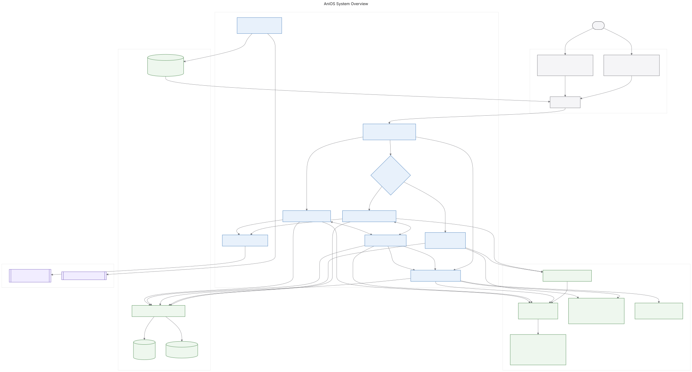

# AniOS Architecture

This document describes the repository as implemented. Runtime results and active blockers belong in [NEXT_SESSION.md](NEXT_SESSION.md); future delivery sequencing belongs in [ROADMAP.md](ROADMAP.md).

## Status labels

- `SCAFFOLDED`: structure exists, but complete behavior is not implemented or demonstrated.
- `MOCKED`: a placeholder or fixed implementation supplies the behavior.
- `PLANNED`: the capability is future work.

The absence of one of these labels does not imply runtime verification.

## Canonical system diagram



The editable source is [anios-system.mmd](diagrams/anios-system.mmd). It describes current implemented and explicitly scaffolded relationships only, including the typed main-supervisor route, editable diagrams, generated and uploaded raster artifacts, local binary storage, Compose-managed vLLM inference, ComfyUI, Qwen vision analysis, their browser integration, and the durable presentation worker. Aligned multimodal image embeddings and hybrid opt-in web research are included. General dynamic agent teams, A2A, and GPU-capacity leases remain outside the current diagram until their runtime boundaries exist. The render/check procedure is documented in [DEVELOPMENT_GUIDE.md](DEVELOPMENT_GUIDE.md#architecture-diagram-maintenance).

The self-contained [manager-facing architecture page](architecture.html) publishes all 13 canonical views with a current model-role summary, direct full-size SVG and Mermaid-source links, and independent per-diagram zoom controls. Eleven views describe the current system; the separately labelled visual-memory/editing and inference-scaling targets describe accepted future designs without claiming implementation. Its opening orchestration contract states explicitly that `MainSupervisorAgent` is currently deterministic and makes no LLM call.

## Detailed subsystem diagrams

AniOS currently has a modular FastAPI backend rather than independently deployed internal microservices. These concise orientation views show ownership, major components, and primary flows; exact endpoints, schemas, and exception paths remain in this document and the code. The [diagram catalog](diagrams/README.md) explains which view answers each common technical question.

| Current view | Technical scope | Source | SVG |
| --- | --- | --- | --- |
| Runtime and deployment | Processes, ports, protocols, Compose, vLLM, database sessions, migration and maintenance paths | [source](diagrams/runtime-deployment.mmd) | [view](diagrams/runtime-deployment.svg) |
| Inference scaling target | Implemented role/adapter authority plus planned capacity placement, replicated vLLM pools, specialist pools, serving control plane, and model SLOs | [source](diagrams/inference-scaling-target.mmd) | [view](diagrams/inference-scaling-target.svg) |
| Chat orchestration | Request ownership, typed supervisor delegation, deterministic web-search and image-recall routing, memory planning, history, LangGraph streaming, persistence, proposals, artifact branch, SSE | [source](diagrams/chat-orchestration.mmd) | [view](diagrams/chat-orchestration.svg) |
| Search and research | Query minimization, cloud-worker isolation, Google/Tavily provider policy, quota, MCP serialization, and source provenance | [source](diagrams/search-research-subsystem.mmd) | [view](diagrams/search-research-subsystem.svg) |
| Memory subsystem | All short/long-term forms, write authority, coordinator, typed services, pgvector retrieval, lifecycle and operations | [source](diagrams/memory-subsystem.mmd) | [view](diagrams/memory-subsystem.svg) |
| Memory overview (manager) | Plain-language first-contact walkthrough of a memory turn, the approval gate, short-term vs long-term stores, and user data control | [source](diagrams/memory-overview.mmd) | [view](diagrams/memory-overview.svg) |
| Tool memory and MCP execution | Safe descriptors, approved preferences, sanitized outcomes, semantic tool discovery, main-model selection, policy-gated invocation, and bounded untrusted results | [source](diagrams/tool-memory-subsystem.mmd) | [view](diagrams/tool-memory-subsystem.svg) |
| Visual artifacts | Diagram classification/rendering, HiDream generation, validated uploads, opaque binary storage, integrity/deletion, Qwen vision analysis, threaded followup questions, aligned image embeddings and margin-bounded retrieval | [source](diagrams/visual-artifact-subsystem.mmd) | [view](diagrams/visual-artifact-subsystem.svg) |
| Visual memory and editing | Implemented source-aware immutable revisions plus planned non-blocking generated-image observation, versioned semantics, handle-based visual memory, post-edit verification, and derived-data lifecycle | [source](diagrams/visual-memory-editing-target.mmd) | [view](diagrams/visual-memory-editing-target.svg) |
| Architecture maintenance | Explicit repository evidence, local Qwen candidate generation, passive/required-label validation, pinned rendering, review, and manual canonical promotion | [source](diagrams/architecture-maintenance-subsystem.mmd) | [view](diagrams/architecture-maintenance-subsystem.svg) |
| Frontend | Identity/conversation state, view lifecycle, chat components, memory management, typed API/SSE client, diagram rendering | [source](diagrams/frontend-subsystem.mmd) | [view](diagrams/frontend-subsystem.svg) |

## Runtime topology

`docker-compose.yml` defines these services:

| Service | Implementation | Host port | Current architectural role |
| --- | --- | --- | --- |
| `backend` | FastAPI/Uvicorn image built from the root `Dockerfile` | `8000` | HTTP API |
| `presentation-worker` | Same backend image with a dedicated worker command | n/a | Claims durable presentation jobs and executes the focused presentation LangGraph independently of request lifetimes |
| `frontend` | React/Vite dev-server container built from `frontend/Dockerfile.dev` | `5173` | Developer console with bind-mounted source and hot reload |
| `db` | `pgvector/pgvector:pg16` | `5432` | PostgreSQL conversation/personal-memory persistence and pgvector semantic search |
| `redis` | `redis:7-alpine` | `6379` | Shared expiring model-execution lease and foreground-wait counter; no prompt or response content is stored |
| `vllm-main` | Pinned `vllm/vllm-openai` image with pinned Qwen revision | `8003` | OpenAI-compatible generation, native tool-call, structured-output, diagram, and vision service |
| `vllm-embedding` | Pinned `vllm/vllm-openai` image with pinned Nomic model and remote-code revisions | `8004` | OpenAI-compatible 768-dimensional text embedding service; starts only after `vllm-main` is healthy |
| `comfyui` | CUDA/PyTorch image (`docker/comfyui/`) that bind-mounts the host ComfyUI install | `8188` | Opt-in (`comfyui` profile) GPU image generation |
| image embeddings | `nomic-embed-vision-v1.5` ONNX, in-process on CPU | n/a | Aligned 768-dim image vectors for multimodal retrieval |
| web research | Built-in stdio MCP server; isolated Gemini 3.6 Flash/Google Search worker with Tavily fallback | n/a | Opt-in; Tavily is active with `SEARCH_API_KEY`, while Google primary requires `GOOGLE_API_KEY` or `GEMINI_API_KEY` |

The `frontend` container bind-mounts `./frontend` and runs Vite with polling so hot reload works across the Docker mount; its browser page still calls the backend at `localhost:8000`. The backend image has no source bind mount and does not use reload mode, so backend source changes require an image rebuild for container validation; a host-source Uvicorn run remains supported for backend development and must not share port `8000` with the Compose backend.

vLLM is part of the default Compose runtime. The pinned `vllm-main` service exposes `Qwen/Qwen3.5-4B` as `qwen/qwen3.5-4b` at host port `8003`; the pinned `vllm-embedding` service exposes `nomic-ai/nomic-embed-text-v1.5` as `text-embedding-nomic-embed-text-v1.5` at port `8004`. Main, presentation, diagram, and vision roles currently share Qwen, while text retrieval uses Nomic; role settings remain independent and the legacy `LLM_MODEL` remains a fallback. The qualified single-RTX-5080 profile quantizes Qwen to FP8 on load with an FP8 KV cache, and explicitly selects a 16,384-token context, four generation sequences, a 4,096-token scheduler budget, V1 chunked prefill, asynchronous scheduling, and prefix caching; Nomic uses a 2,048-token context and sixteen sequences. FP8 halves resident weights from 8.61 GiB to 5.09 GiB, which is what allows the doubled context to fit alongside host ComfyUI: measured free GPU memory with both services resident rose from 1,860 MiB to 6,588 MiB, and cached tokens rose from 45,428 to 64,046. Prefix caching produced real hits and passed the role suite, but vLLM 0.23 labels its Qwen hybrid-GDN/Mamba `align` support experimental, so it is a bounded local-profile choice rather than an inherited multi-tenant default. Compose starts Qwen to health before Nomic because concurrent cold GPU initialization left no KV-cache blocks during acceptance. The one-command startup preserves that order, warms one constant non-sensitive generation and embedding request to pay deferred JIT costs, and starts host ComfyUI afterward. ComfyUI remains available as the opt-in Compose profile or the lighter host install at `COMFYUI_HOST_PATH` (default `E:/AI/ComfyUI`); the container backend reaches the host process at `http://host.docker.internal:8188`. Generated and uploaded bytes live below the configurable opaque local artifact root; Compose mounts `/app/data/artifacts` from the `artifactdata` volume.

### Model calls per stage

A request is not one model call. Several models run at different stages, and on
this machine they share **one GPU**, so calls serialize - a turn's latency is
dominated by how many model calls it makes, not by any single one. Memory
retrieval planning and memory proposals are **deterministic** keyword logic and
cost no model call.

A chat turn, in order:

| Stage | Model | Runs on | When |
| --- | --- | --- | --- |
| Main supervisor route | none for explicit registered intents (typed deterministic LangGraph policy) | CPU | every chat turn before retrieval; currently delegates explicit presentation creation |
| Query embedding | `text-embedding-nomic-embed-text-v1.5` (`EMBEDDING_MODEL`) | GPU (`vllm-embedding`) | when personal semantic or agent-vector retrieval is selected; one vector is reused across stores and image recall |
| Memory retrieval planning | none (deterministic patterns) | CPU | every turn |
| Web-search routing | `SEARCH_CLASSIFIER_MODEL`, else the main role (`MAIN_LLM_MODEL`, then `LLM_MODEL`) | GPU | when patterns abstain (most non-temporal turns) |
| Image-recall routing | the same classifier model | GPU | only when the query plausibly names a stored image (gated) |
| Tool selection | `qwen/qwen3.5-4b` (`MAIN_LLM_MODEL`) native tool-calls through `vllm-main` | GPU | only when MCP tools are relevant |
| Response generation | `qwen/qwen3.5-4b` (`MAIN_LLM_MODEL`) through `vllm-main` | GPU | ordinary non-delegated turns; the streamed answer |
| Memory proposal | none (deterministic patterns) | CPU | every turn |

A plain message ("my name is Ani") therefore makes about three model calls: one
text embedding plus two main-role calls (the search classifier and the
response). Pointing `SEARCH_CLASSIFIER_MODEL` at a dedicated qualified model
moves both bounded routing classifiers off the main response model.

Image and presentation paths:

| Stage | Model | Runs on |
| --- | --- | --- |
| Image generation / slide image | `hidream_o1_image_dev_fp8_scaled.safetensors` (`IMAGE_MODEL`) via ComfyUI | GPU (shared with vLLM) |
| Refinement prompt merge | `qwen/qwen3.5-4b` (`MAIN_LLM_MODEL`) | GPU |
| Learned-style distillation | `qwen/qwen3.5-4b` (`MAIN_LLM_MODEL`) | GPU |
| Image vision analysis (ask) | `qwen/qwen3.5-4b` (`VISION_MODEL`) | GPU |
| Image embedding (index and reconciler) | `nomic-embed-vision-v1.5` ONNX | CPU |
| Deck outline, one slide-content microtask per slide, or slide revision | `qwen/qwen3.5-4b` (`PRESENTATION_LLM_MODEL`) | GPU |
| Diagram generation | `qwen/qwen3.5-4b` (`DIAGRAM_LLM_MODEL`) | GPU |
| Architecture candidates | legacy `LLM_MODEL` unless its CLI environment is overridden | GPU |
| Google-grounded research, when enabled | `gemini-3.6-flash` (`GOOGLE_SEARCH_MODEL`) | external Google API |

Web research, only when routing decides to search, calls Google Gemini grounding
or Tavily - external/cloud, not the local GPU. Main, presentation, diagram, and
vision role names are independently configurable, but the current RTX 5080 is
still one physical GPU. Redis prioritizes chat over presentation microtasks; it
does not provide multi-model capacity accounting.

### Aligned image embeddings and web search

Images are embedded locally by `nomic-embed-vision-v1.5`, run in-process through
ONNX Runtime on CPU from `data/models/` (weights are not committed; see the
development guide). The encoder is aligned to the latent space of
`nomic-embed-text-v1.5`, so image vectors share the same 768 dimensions as text
memory and a text query embedded by the ordinary text embedder retrieves images
directly.

Alignment gives comparable *ordering*, not comparable *magnitude*. Measured on
this system, a matching text-to-text pair scores about `0.73` cosine similarity
while a matching text-to-image pair scores about `0.08` - the modality gap. Image
vectors therefore live in their own `visual_artifacts.embedding` column with
their own HNSW index and their own bounds; they are never ranked in one list
against text memory by raw distance, because every unrelated text memory would
outrank every matching image. Generated and uploaded images are embedded once at
store time; a followup question does not re-embed, because the pixels have not
changed. Diagrams hold Mermaid source rather than pixels and are excluded.

Two retrieval paths reach stored images. Vision analysis text is embedded into
`semantic_memory` under the dedicated `visual_artifact_analysis` purpose, which
keeps derived model output separate from the approval-gated path that persists
user-stated facts; that makes an image findable by what was said about it. The
aligned image vector makes it findable by what it actually depicts, including
detail no caption mentioned. Generated images have no analysis text, so the
vector is their only index.

In chat, `ImageRecallPolicy` decides when a turn is a recall request and
explicitly refuses creation requests, so "draw me a fox" can never be answered
with an archived fox. Matches stream to the interface as an `image_matches` SSE
event before the answer, and enter the prompt as untrusted quoted data telling
the model the images are already displayed.

`ImageRetrievalPolicy` decides which ranked hits are real matches, and it needs
two bounds because a distance ceiling alone is provably insufficient. Measured
over an 18-query labelled set against eight generated images, relevant queries
placed the correct image first every time at distances of `0.9090`-`0.9419`,
while unrelated queries returned their nearest image at `0.9518`-`0.9699`. Those
bands look separable, but a genuine weak match measured `0.9531` on other data,
inside the distractor range: no absolute cutoff separates them.

The discriminating signal is the margin between the best hit and the runner up.
A real match pulls clearly ahead (`0.0211` minimum observed) while an unrelated
query leaves every image roughly equidistant (`0.0107` maximum, and exactly
`0.0000` for one query). The policy therefore applies
`VISION_SEARCH_MAX_COSINE_DISTANCE` (`0.96`) as a coarse ceiling and
`VISION_SEARCH_MIN_MARGIN` (`0.015`) as the discriminator. With both bounds the
labelled set scores 14/14 correct top-1 results and 4/4 distractors correctly
returning nothing; with the ceiling alone every distractor produced a false
positive.

Candidates must be fetched **without** a distance pre-filter
(`ImageRetrievalPolicy.CANDIDATE_CEILING`). Filtering in SQL first can discard
the runner up, which leaves a single row that looks like a lone result and
silently bypasses the margin check; that regression is covered by a test.

Because these bounds are calibrated rather than derived, they should be
re-measured as a library grows: more images shrink inter-image margins.

Web research is reached through the built-in read-only
`internet/search_web` stdio MCP server when `SEARCH_PROVIDER_NAME=mcp`; the
legacy direct Tavily adapter remains configurable. `HybridSearchProvider`
prefers an isolated Google ADK worker when `GOOGLE_API_KEY` or
`GEMINI_API_KEY` is configured, falls back to Tavily when Google is disabled,
empty, unavailable, or over its local daily budget, and calls both providers
only when the user explicitly asks to verify or cross-check. A deterministic
`SearchRoutingPolicy` owned by the application decides when a turn needs live
data; neither the local model nor the cloud worker owns outbound eligibility.

The Google worker is a request-scoped `gemini-3.6-flash` ADK `Agent` with the
native `google_search` tool. Each call creates a random in-memory session,
disables prior contents, and sends only the already normalized and
privacy-screened public query under a constant anonymous worker identity. It
receives no AniOS user/conversation ID, history, personal memory, documents,
image bytes, MCP credentials, or execution authority. AniOS rejects a response
without grounding metadata and attributable web sources so fallback can run.
This is one specialized research agent behind the existing provider contract,
not general LangGraph subagent scheduling or A2A.

`SQLiteDailySearchQuota` reserves Google calls atomically across short-lived
stdio processes. It persists only provider, Pacific calendar day, and count in
the `searchdata` volume; it does not store query or result content. The default
local limit is 450 calls/day. This is a safety ceiling, not proof of provider
quota or free access. Current Gemini 3 Search Grounding availability depends on
the Google API project's plan and billing state; AniOS never enables billing or
switches tiers automatically. The unpaid Gemini service may use submitted
prompts and responses to improve Google products, so the existing minimization
boundary is mandatory and sensitive/private content must not be sent.

`ImageRecallPolicy` performs the equivalent routing for image recall and
explicitly refuses new creation requests while recognizing historical questions
and referential phrases such as "that car." Generated-image metadata retains a
bounded generation prompt, so a later chat turn can answer what was requested
without pretending to inspect absent pixels. Search results and image
descriptions both enter the final main-model prompt as untrusted quoted data.

When the user explicitly requests web search about a matched image, image recall
runs first. AniOS appends at most one bounded stored analysis or generation
prompt to the normalized search subject, screens the combined text with
`OutboundPrivacyPolicy`, and only then calls the internet MCP tool. Image bytes
never cross the outbound-search boundary. A blocked description blocks the
whole provider call rather than falling back to the less useful raw question.

Routing is a cascade. Deterministic patterns answer the obvious cases for free
and cannot drift; whatever they do not match is referred to a bounded local
classifier that returns a single word. The classifier judges the *question*, not
what to do about it, so the application keeps ownership of routing and a
confused answer can at worst cause one unnecessary search. An unavailable
classifier leaves the deterministic answer standing rather than turning every
turn into a search.

Measured against FreshQA, which labels 600 questions fast-changing,
slow-changing or never-changing, patterns alone recalled 45.6% of questions
whose answers move, because volatility is rarely phrased explicitly: "When did
OpenAI release GPT-5?" needs live data and contains no temporal marker. The
cascade raises that to 86.9% and overall accuracy from 62.3% to 81.7%, at the
cost of specificity falling to 69.4%. That trade is deliberate: an unnecessary
search costs a second, while a missed one produces a confident stale answer.

The prompt dominates the result, more than model size does. Zero-shot the same
cascade recalled 59.5%; few-shot examples supplied as real conversation turns
carry the gain. A completion-style prompt blob is silently reinterpreted by a
chat template, and small models then answer conversationally instead of
classifying, so the examples are sent as alternating user/assistant turns.

Smaller local classifiers were measured and rejected. Against an "always
search" baseline that ignores the question entirely and scores 70.0% accuracy,
qwen3-1.7b also scored 70.0% and qwen3-0.6b 70.8%: both were effectively
constant-YES answers costing a dependency and latency for nothing. The 12B chat
model reached 81.7% because it was the only candidate that discriminated.
`SEARCH_CLASSIFIER_MODEL` keeps the choice configurable should a better small
model appear.

Pattern coverage matches volatile *shapes*, not just temporal vocabulary. An earlier
pattern set keyed on words like "latest" and "current" and reached only 11 of 18
volatile queries in a 30-query labelled set: "who is the CEO of OpenAI",
"how much does a Tesla Model 3 cost" and "is it raining in Seattle" all fell
through and were answered from stale training data. Patterns for role holders,
cost questions, market events, schedules, live metrics and unworded weather
raised that to 18 of 18 while the 12 stable queries stayed correctly unrouted.
Role matching is restricted to roles that actually turn over, so "who is the
author of" remains stable.

A bare temporal word is not a reliable signal on its own, because it attaches
equally to an information need ("what shipped last month") and to a statement
about the user's own life ("I graduated last month"); the difference is intent,
not vocabulary, so no pattern can separate them. Rather than enumerate the
unbounded ways a person phrases their life - a losing game - the policy detects
the one thing here that is finite and stable, self-reference (`I/me/my/we/our`),
and treats a weak temporal-or-year signal as authoritative only when the query
is not about the user. When self-reference accompanies only a weak signal the
patterns abstain (`ambiguous_self_reference`) and the cascade defers to the
classifier, which judges intent holistically: "I moved to Seattle last month"
and "what did I do last week" resolve to no search, while "what is the latest
treatment for my psoriasis" still searches the public topic. A strong topic
signal (weather, price, a role holder) still resolves deterministically even in
a first-person sentence, and a temporal query with no self-reference still
routes on its own, so the fast path is unchanged for the common case.

Search-control wording such as "search online for" and "cite the source" is
removed before provider submission so the selected provider receives the factual subject.
Every query is then screened by `OutboundPrivacyPolicy` before it leaves the machine,
which the roadmap requires and the first implementation omitted: the raw user
query was sent verbatim. Two outcomes exist. A query carrying a secret or an
account identifier is blocked outright and no request is made, because no
rewrite makes an API key, email address or card number safe to send. A query
that merely attaches a sensitive topic to the user is minimized instead: "what
should I do about my psoriasis flare-up" is sent as "psoriasis flare-up",
because the search value lives in the topic rather than in whose topic it is.
Screening is deterministic and runs outside the model, since a model asked to
redact its own prompt can be argued out of it. Only the category and trace ID
are logged, never the text that triggered them, and the interface reports both
outcomes so a withheld or rewritten search is visible rather than silent.

Scored Tavily results are filtered by provider relevance before reaching the prompt.
Measured across 40 real results the score distribution is bimodal: usable hits
scored 0.561-0.923 and dictionary-definition noise scored 0.046-0.346, with an
empty band between, so `SEARCH_MIN_SCORE` sits at `0.4`. Admitting that noise
would be worse than returning nothing, because the prompt instructs the model to
prefer web results over its own recollection for time-sensitive facts.

A searching turn is visible and auditable. `search_started` and
`tool_started` are emitted before an MCP-backed provider call,
the provider call rather than after it, since search is the slowest step, and
`search_results` always follows with the sources consulted - including an empty
list on failure, so the interface retracts its indicator instead of spinning.
The browser renders search and tool lifecycle status, then provider-attributed
cited sources beneath the answer, so a reader can check what grounded it.

### Visual semantics, memory references, and source-aware editing

This subsection and
[visual-memory-editing-target](diagrams/visual-memory-editing-target.svg)
describe a staged architecture. Source-aware editing is implemented and
verified; automatic generated-image observation, visual aliases/reference
resolution, semantic post-edit verification, bounded correction, and derived
data lifecycle remain `PLANNED`.
[ADR 0007](adr/0007-versioned-visual-semantics-memory-and-editing.md) owns the
decision.

The target pipeline does not make generated-image availability wait for a VLM.
After the current generation boundary validates, stores, and displays the
pixels, an application-owned durable observation job reads the exact owned
bytes through the existing integrity boundary. A replaceable
`VisionSemanticsProvider` returns a typed, bounded `VisualObservation` containing
caption, objects, attributes, relationships, OCR, confidence, model, schema,
source hash, and provenance. Observations are append-only and versioned by
artifact revision, plaintext SHA-256, schema, and model; a failed observation
does not invalidate a ready image.

Visual memory stores no duplicate image bytes. It stores user aliases,
collections, derived semantic vectors, and immutable artifact/revision handles.
`VisualReferenceResolver` will fuse exact aliases, semantic-description search,
the existing aligned pixel-vector search, conversation, recency, and lineage
state. Each signal retains its own calibrated scale. A minimum score and
best-to-runner-up margin are required; ambiguous matches produce a visible
clarification. Before any VLM, editor, agent, or MCP tool receives pixels, the
application resolves the handle and rechecks owner, ready status, deletion
state, byte size, and SHA-256.

Editing is a separate provider capability from understanding.
`ImageRefinementService` re-reads owned, integrity-checked generated or
uploaded source bytes,
adds bounded preservation constraints to the exact user feedback, and invokes
`ComfyUIImageEditProvider`. The provider runs the official-style FLUX.2 Klein
4B Distilled FP8 single-reference workflow through ComfyUI with a Qwen 3 4B
encoder, FLUX.2 VAE, four sampling steps, and one-job concurrency. Deterministic
image validation precedes an immutable ready child carrying its parent ID,
source SHA-256, exact feedback, model, seed, steps, and provider latency. The
frontend replaces the active card in place while retaining both database
revisions. Prompt-only HiDream regeneration and the experimental SAM recolor
branch are not fallbacks.

Semantic verification remains a separate planned promotion gate. It will
compare a candidate child with the requested delta and preservation constraints,
permit at most one bounded correction, or retain the parent with a visible
failure. A focused future `VisualAgent` may propose a typed edit plan, but
application code continues to own authorization, limits, provider selection,
resource leases, retries, storage, and promotion.

### Observability

Tracing is OpenTelemetry, off by default and safe to enable without a
collector: an unreachable OTLP endpoint drops spans in the background rather
than failing a request. `configure_telemetry` instruments FastAPI so each
request is a span, and httpx so every outbound call - vLLM, Tavily, an
HTTP MCP server - is an auto-propagated child span carrying W3C trace-context.
That is what turns "the turn was slow" into "the turn spent 1.4s in the Tavily
call", without guessing.

The custom `ConversationTracer` is retained and wrapped rather than replaced.
`OpenTelemetryConversationTracer` never opens or closes a span - the FastAPI
instrumentation owns span lifecycle, so it cannot leak one - and instead stamps
the application trace id onto the active request span and records each domain
step as a span event. Step metadata is stringified and bounded, so a trace
backend receives structure, never query, argument, or result text.

### Module boundaries

Packages are separated by what they own rather than by when they were written,
and the separation is enforced by tests rather than convention:

| Package | Owns |
| --- | --- |
| `backend/mcp` | The protocol: server configuration, stdio/streamable-HTTP sessions, built-in servers, tool metadata, and inspection of untrusted server text |
| `backend/capabilities` | Agent-facing application adapters, including the local visual FastMCP facade over existing services |
| `backend/search` | Web research only: direct/MCP provider adapters, isolated Google ADK worker, hybrid/fallback policy, non-content quota, query normalization, routing patterns, and the classifier cascade |
| `backend/artifacts` | Visual artifacts, including image recall routing and margin-bounded image retrieval |
| `backend/core/egress` | Screening any text before it leaves the machine |
| `backend/services` | Orchestration that composes the layers above |

`backend/mcp` imports nothing from `backend/services` or `backend/api`, so the
transport can be replaced or exercised without the application around it.
The higher-level `backend/capabilities` package may compose application
services; this keeps the generic protocol package independent while allowing
local capabilities to use the same business logic as browser APIs.

Two placements are deliberate. Image recall and image retrieval sit with the
artifacts they serve rather than under `search`, where "search" had come to
mean web search, image retrieval and outbound screening at once. The screening
policy sits in `core/egress` because it governs every outbound request: a tool
argument sent to a third-party MCP server carries the same disclosure risk as a
search query, and a second implementation is how the first gets bypassed.
`test_architecture_boundaries.py` fails on a crossed boundary, a stray module
under `search`, or a duplicate screening policy.

### MCP tool discovery and chat invocation

Configured MCP servers are reached over one of two transports, chosen per
server. `stdio` launches the server as a local subprocess, which is how most
servers are distributed and how local development runs, but requires the
server's runtime to be present. `http` connects to an already-running service
over streamable HTTP, which is what a deployed sibling container or a remote
vendor exposes and needs no extra runtime in this image. The transport is
resolved in one place (`backend/mcp/session.py`); discovery and invocation never
learn which is in use, so adding Google Drive as an HTTP sibling changes
configuration, not code.

Their live catalogues are indexed
into `tool_descriptors`, so a large registry can be narrowed by meaning before
anything reaches the model. Published results make the reason concrete: naive
exposure of 100+ tools drops selection accuracy to roughly 13%, against about
43% when tools are retrieved, and beyond a few hundred tools selection
approaches random. Retrieval returns a handful (`TOOL_SEARCH_MAX_RESULTS`).

Tool descriptors need their own retrieval bound. A natural-language question
sits further from short structured tool text than memory text sits from memory
text: measured against a live catalogue, correct tools landed at 0.295-0.437
while unrelated questions sat at 0.477 and above, so the general memory
threshold of 0.35 silently discarded correct matches. Tool search therefore uses
`TOOL_SEARCH_MAX_COSINE_DISTANCE`, calibrated to 0.45. This is the third store
in the system to need its own bound, after personal memory and image vectors.

For an ordinary chat turn, `MCPToolOrchestrationService` searches that
user-scoped descriptor index, discards consequential servers, re-resolves each
candidate against the live catalogue, and exposes at most five current schemas
to the configured main model through vLLM's native OpenAI-compatible
`tool_calls` contract. The model may select at most one call and supply
schema-shaped arguments; it never
receives an invocation handle. AniOS converts the selected alias into an
application-owned plan and executes it only through the gates below.

Server metadata is untrusted. Three properties follow:

- **Trust is assigned locally.** `risk_classification` comes from the operator's
  configuration, never from the server describing itself.
- **The fingerprint covers the description, not only the schema.** A server that
  keeps its contract but rewrites its description can smuggle instructions to
  the model without changing anything a schema hash would notice - the rug-pull
  window that opens when a server is approved once and trusted afterwards.
- **Instruction-shaped descriptions are quarantined, not indexed.** A tool
  description exists to say what a tool does. One that says what the *model*
  should do is attempting tool poisoning, and indexing it would place that text
  in front of the model during discovery.

Discovery is not authorization. A descriptor narrows candidates; the call
itself passes through gates that treat storage as a hint and the live server as
the truth. Every invocation, in order:

1. Resolves the server from local configuration, never from the request.
2. Requires explicit confirmation unless the operator classified the server
   `trusted` or `read_only`. A wrong read is recoverable; a wrong write is not.
3. Re-reads the live catalogue and refuses a tool that is no longer offered, so
   a stale vector cannot authorize a call.
4. Compares the live fingerprint with the descriptor that was selected and
   refuses a changed contract.
5. Re-inspects the live description, because a server may have rewritten it
   since indexing.
6. Validates arguments against the declared schema. A wrong tool usually cannot
   accept the right tool's arguments, so this is the cheapest signal that
   similarity chose badly.
7. Screens every string argument through `OutboundPrivacyPolicy`, the same gate
   web search uses.

A transient transport failure is retried, but only for a call that can be
replayed without consequence. `MCPRetryPolicy` grants extra attempts solely to
`read_only` and `trusted` servers - the same classifications that skip
confirmation, because a call safe to make unconfirmed is safe to repeat - and
only on genuine transport errors (`ConnectionError`, `TimeoutError`, `OSError`).
A consequential server gets exactly one attempt: a dropped connection does not
prove the write never reached the server, so retrying it risks doing it twice.
A deterministic refusal - a gate rejection, a schema failure, a privacy block -
is never retried, because re-running it would fail identically. The gates above
still run once per call; retry wraps only the transport, never the policy.

Results are bounded and inspected. Instruction-shaped output is flagged and
rendered to the model as quoted, clearly attributed data with an explicit note
not to follow it. Verified against a live server: a valid call returns, while
unknown arguments, wrong types, a credential-bearing argument, a stale
fingerprint, a withdrawn tool and an unconfirmed consequential server are each
refused before any request reaches it.

The built-in `local_utility/current_time` server is the live acceptance fixture
for main-model-selected MCP use. The built-in `internet/search_web` server receives
only an already normalized and privacy-screened query and inherits only
operator-allowlisted search environment names. It emits compact valid JSON
below the generic MCP result cap. Internet eligibility remains deterministic
application policy; it is not delegated to the model.

The Compose `local-capabilities` sidecar exposes visual and presentation
application services as seven streamable-HTTP FastMCP tools:
`generate_diagram`, `generate_image`, `ask_about_image`, `get_artifact`,
`create_presentation`, `revise_presentation_slide`, and `get_presentation`.
Their model-visible schemas contain task arguments only. The backend attaches
user, conversation, and trace ownership as MCP request metadata only because
this locally configured server opts into `forward_context`; other servers
receive no application context by default. Results contain bounded public
artifact or deck metadata, never binary image/PPTX data or private storage keys. The server
is classified `untrusted`, so calls require explicit confirmation and are not
offered to ordinary autonomous chat selection until a browser
proposal/approval/resume lifecycle exists.

## Backend boundaries

### Ambient discovery

Milestone 6's ambient discovery is partly implemented and not yet wired end to
end. Three stages exist as independent boundaries.

`discovery_interests` and `discovery_localities` hold what the user likes and
where they live, behind `/api/v1/discovery/{user_id}`. Labels are sealed with
`EncryptedText` and identified by a SHA-256 digest of their normalized form,
because a sealed column cannot back a unique constraint: each value is encrypted
with a fresh nonce, so equal plaintext does not produce equal ciphertext. Case
and spacing differences therefore resolve to one interest while the readable
copy stays encrypted at rest. Interest provenance is validated against an allowed
set so an inferred value cannot be stored as a user-stated one, and the list is
bounded because every label is eligible to enter a chat prompt. Home coordinates
are deliberately absent: they would be the most sensitive value the application
holds and nothing consumes them yet. The profile is rendered into ordinary chat
context, so the assistant answers from the same record a scheduled run reads.

`backend/discovery/events.py` defines a provider-neutral `EventSource` returning
typed events with a stable per-source identity, start, place, and link, with
iCalendar and RSS/Atom adapters parsed using the standard library. Discovery
reads structured listings rather than searching: local listings are already
structured, and search is the one part of the loop with a hard monthly ceiling.
Feeds are treated as hostile input — control characters stripped, text bounded,
non-web URL schemes dropped, 200 events per source, and bodies abandoned
mid-stream past 5 MB. A `RequestBudget` fixes how many outbound requests one run
may make, so the free-tier claim is decided in advance rather than emerging from
how many sources happen to be configured. RSS is deliberately weaker than
iCalendar: an item states when it was published, not when the happening occurs,
so items carry no start time unless the publisher supplies an explicit event
date.

`discovery_schedules` and `discovery_runs` hold one user's cadence and each
durable, leased sweep. Leasing reuses the presentation-worker pattern rather than
introducing a second scheduler. Two invariants carry the milestone's
never-double-notify requirement: a unique constraint on
`(schedule_id, scheduled_for)` makes a slot exactly-once, so a restarted producer
cannot queue the same sweep twice, and `delivered_at` is written once, so a
resumed run declines rather than delivering again. Cadence is computed in the
user's own timezone, including the daylight-saving case where a 9am sweep must
stay 9am rather than drift with the old UTC offset.

The run body, novelty filtering, calendar artifacts, and notification egress
remain `PLANNED`; stage 3 delivers the machinery and stage 4 supplies the
selection it will persist.

### Presentation

`backend/main.py` constructs the FastAPI application, allows CORS from the local Vite origins, mounts the v1 router at `/api/v1`, and defines `GET /health`.

`backend/api/v1/api.py` defines:

- `GET /api/v1/`;
- `POST /api/v1/chat`, which validates a typed `ChatRequest` and returns Server-Sent Events named `start`, `delta`, optional search/tool/memory/artifact/image lifecycle events, and `done`. A streaming failure is logged server-side and returned as a sanitized `error` event.

`backend/api/v1/memory.py` defines user-scoped profile, generic approved-fact lifecycle, preferred-name approval/deletion, episodic/semantic create-correct-search-delete, export, and delete-all endpoints beneath `/api/v1/memory/{user_id}`. `backend/api/v1/agent_memory.py` adds typed semantic-cache, working-memory, procedure, entity/relation, knowledge-document/chunk, conversation-summary, retention, re-embedding, operations, and per-record deletion routes beneath `/api/v1/memory/{user_id}/agent`. Approved facts carry source conversation/trace provenance; normalization deduplicates equal values, contradictions create a superseding version, and supported `preferred_name`/`response_style` keys project into `user_profiles`. Export and delete-all cover conversation, personal, tool, and agent-memory tables.

`backend/api/v1/artifacts.py` lists recent owned artifacts, returns owned binary content with private/no-store and nosniff headers, and deletes both the database row and binary file. Explicit diagram requests create a pending record before provider work and stream a sanitized terminal success or failure lifecycle. If the client disconnects after pending persistence, the application shields only the terminal cleanup write, marks the record failed with `cancelled`, and re-raises cancellation.

`backend/api/v1/images.py` accepts a bounded prompt and one allowlisted HiDream training resolution, then returns a terminal generated-image artifact. Its refinement route reads an owned generated or uploaded parent and passes the integrity-checked source pixels plus exact bounded feedback and preservation constraints to the configured FLUX.2 Klein editor. It creates a fresh child carrying parent, source-hash, feedback, model, seed, step, and latency provenance. `backend/api/v1/vision.py` streams a bounded multipart upload, validates actual PNG/JPEG/WebP content, rejects animation, MIME mismatch, excess bytes, and excess pixels, persists the owned upload, and sends only the validated image plus bounded prompt to the configured local vision provider. Invalid uploads create no artifact; VLM failure preserves the valid upload with `analysis_status=failed` for later deletion or retry work. `POST /api/v1/vision/artifacts/{artifact_id}/ask` accepts a bounded question about any owned ready generated or uploaded image, re-reads the integrity-checked stored bytes rather than requiring a new upload, replays a bounded prior question/answer context to the same vision provider, appends the grounded answer to a size-bounded thread persisted in artifact metadata, and returns 404 for unowned or non-ready images without invoking the provider. This threaded follow-up analysis lives only on the artifact record; it is not written into the memory subsystem. Two other paths do feed retrieval: every stored upload and refined child receives an aligned Nomic pixel embedding, and the initial upload analysis is indexed into semantic memory as a provenance-labelled description, so an uploaded image's content is recalled by an ordinary conversation turn (verified: an uploaded image described by the VLM was retrieved from semantic memory in a later conversation). Only the interactive follow-up thread remains un-indexed.

`backend/api/v1/tools.py` exposes explicit policy-gated MCP invocation. For a
configured context-aware local server, it starts a trace and forwards the
authorized path user plus optional conversation ID as hidden request metadata;
those ownership values are not part of the tool arguments selected by a model.

A deck is editable as a structure, not only as content. Beyond slide revision,
`POST .../slides` inserts a slide at a 0-based position, `DELETE .../slides/{id}`
removes one, and `PUT .../slides/order` permutes the deck. Each is an ordinary
linked revision, so every structural change is reviewable and reversible through
the same history as a content edit. Position is an index rather than an "after
this slide" reference, because the first position has no slide before it.
Reordering sends the complete order and refuses anything that is not a
permutation; deletion refuses the last remaining slide; both prevent a partial
request from silently dropping or duplicating a slide. Adding runs the model on
the deck's titles and purposes only, so an addition cannot rewrite slides the
user already accepted, and no model runs for deletion or reordering at all.

A slide takes one of seven shapes: bullets, section, statistic, quote,
comparison, chart, and table. The model chooses the shape and deterministic code
still owns geometry. The layout is an enum in the decoding grammar, and the
fields a layout needs are promoted to `required` for that call with their null
branch removed, so a chart slide without chart data is not a decodable reply.
Naming the fields in prose was not sufficient in either direction: the model
returned chart layouts with no data, and later a prompt asking to keep the
current shape contradicted a grammar asking for a new one. The compiler still
degrades a layout it cannot render to bullets rather than raising, so a partial
plan produces a usable slide. Charts and tables compile from the plan, which is
what lets a revision edit their data or remove them; only an attached image
survives a revision, because nothing regenerates it.

Geometry is measured rather than fixed. `backend/presentations/layout.py`
estimates rendered line count from text length, box width, and point size, so
the compiler sizes a title to its actual content, stacks bullets at their own
heights, and shrinks the body font within bounds when content is dense instead
of overflowing. Every content layout derives its width from one place and yields
the column a generated image occupies, including the heading band, whose purpose
line sits low enough to reach the picture's top edge.

`backend/api/v1/presentations.py` enqueues creation with HTTP 202 and returns an
owned job handle. Job reads expose queued/running/terminal state and the latest
validated draft; cancellation is cooperative. The legacy creation SSE endpoint
uses the same durable job and polls persisted progress, so a browser disconnect
does not terminate work. The React panel stores the active job ID per user,
polls it across navigation and reload, renders arriving slides, and hydrates the
ready deck after the background worker promotes its revision. The selected-slide
image endpoint uses HiDream when no image exists; when an `ImageElement` is
already attached, `PresentationImageService` sends that owned source artifact
and explicit image feedback through `ImageRefinementService`, then replaces the
image UUID in a new append-only deck revision. The surrounding native Office
objects remain editable, and the prior deck/image revisions remain intact.

The image-generation handler monitors HTTP disconnects around provider work. A browser cancellation cancels the service task, interrupts the matching ComfyUI prompt, shields the terminal `failed/cancelled` write, and finishes without an application exception. The unified React composer infers new-image generation from bounded natural-language intent and image analysis from an attachment while retaining progress, cancellation, retry input, visible API failures, and bounded file selection. `ImageArtifact` fetches private bytes with the optional auth header, renders a temporary object URL, exposes grounded Qwen text, and supports local download, owned deletion, ordinary vision questions, and non-destructive source-conditioned refinements of generated or uploaded images. The follow-up classifier recognizes bounded imperative and polite question-shaped edit requests before general question words. A returned FLUX child revision replaces its parent in the active chat card rather than appending a duplicate card, while persisted parent lineage keeps history recoverable. Conversation hydration and artifact history restore both diagrams and binary images.

`backend/api/v1/conversations.py` returns a bounded, user-owned conversation snapshot containing persisted turns and their conversation artifacts. The frontend uses that read boundary to reconstruct the active transcript and ready/failed diagram cards after a full reload.

The Memory panel loads only bounded counts and snapshots initially. Every
memory-map card is an accessible detail action; selecting a durable store makes
an explicit owned export request, shows readable records on demand, bounds the
rendered list, and omits embedding vectors and private storage keys.

Every chat, memory, and presentation route applies the optional signed-user ownership boundary. Authentication is disabled by default for trusted-local development; when enabled, the token subject must equal the body or path user ID.

Ownership answers *who*; scopes answer *what*. A token may be narrowed to least-privilege scopes - `chat`, `memory:read`, `memory:write`, `tools:invoke`, `vision`, `presentations`, or the `memory`/`tools` groups - and each route requires the scope matching its action, so a read token satisfies a `GET` but is refused a `DELETE` before the handler runs. A group scope satisfies its children (`memory` covers read and write); a token with no scope claim stays unrestricted, so scopes were adopted without invalidating the tokens or tests that predate them, and an unknown scope is rejected when the token is issued rather than becoming a silently powerless grant. Scopes narrow a valid token; they never replace the ownership check, which still binds the request to the subject.

Sensitive content is optionally encrypted at rest. With `ENCRYPTION_KEY` configured, an `EncryptedText` column type seals conversation turns and episodic/semantic memory content with AES-256-GCM at the persistence boundary - no repository or serialization change - and the binary artifact store seals image bytes on write while recording integrity over the plaintext, so the existing SHA-256 re-check after a read still holds. The sealed form is self-describing (`enc:1:…`) and legacy plaintext reads back unchanged, so enabling encryption needs no migration; each value uses a fresh nonce, which is exactly why the type is applied only to content retrieved by id or vector and never to a deduplication or uniqueness column. This is defence in depth over OS full-disk encryption for data that leaves the process without the key, not a sandbox against a live compromised host, and embedding vectors stay searchable and therefore unencrypted - a documented residual disclosure vector. See docs/SECURITY.md for the threat model.

### Services and dependency assembly

`backend/core/dependencies.py` assembles `ConversationService` and its collaborators through FastAPI dependencies.

The active collaborators are:

| Component | Status | Implemented reality |
| --- | --- | --- |
| `ConversationService` | implemented local boundary | Obtains a memory query plan, loads selected context plus bounded same-user history, streams an injected model through LangGraph, persists the response, and updates memory lifecycle state |
| `PostgresMemoryService` | implemented local boundary | Supports profile upsert, episodic save/read, live embedding generation, pgvector semantic save/search, snapshots, and scoped deletion |
| `AgentMemoryManager` | implemented typed store facade | Owns user-scoped semantic-cache, working, procedure, entity/relation, knowledge, and summary stores without exposing raw tables to the coordinator or model |
| `MemoryCoordinatorAgent` | implemented deterministic policy boundary | Searches every embedded store on each turn so anything relevant can be recalled regardless of phrasing, embeds the query once and reuses that vector across all of them, relies on each store's cosine-distance threshold and one shared cross-store relevance budget (with dedup and item/character caps) to keep only close matches, selects the non-embedded episodic store by explicit keyword intent, writes expiring session state, and periodically rolls conversation digests |
| `ToolMemoryService` | implemented safe metadata boundary | Stores and retrieves user-scoped safe tool descriptors, approved preferences, and sanitized outcomes; invocation and authorization remain owned by the separate orchestration and policy boundaries |
| `MainSupervisorAgent` | implemented first-step routing boundary | Runs one typed LangGraph policy node before retrieval; currently delegates explicit presentation creation to the registered `presentation_agent` and otherwise returns the turn to the ordinary assistant path |
| `MCPToolOrchestrationService` | implemented model-selection boundary | Gives the configured main model a bounded live-validated shortlist, accepts at most one native tool call, and produces an application-owned plan without execution authority |
| `MCPInvocationService` | implemented execution-policy boundary | Re-resolves live contracts, enforces local risk policy, validates and privacy-screens arguments, invokes stdio/HTTP tools, and bounds results as untrusted |
| `MCPWebSearchProvider` | implemented read-only search boundary | Invokes the fixed internet MCP tool after deterministic routing and privacy minimization, then validates and filters compact result JSON |
| `VisualCapabilityRuntime` | implemented local FastMCP adapter | Reuses diagram, image, vision, repository, and binary-store services in a dedicated streamable-HTTP process; validates hidden ownership context and returns metadata-only artifact handles |
| `PresentationAgent` | implemented specialized LangGraph boundary | Runs typed create, progressive-create, or revise operations around the replaceable provider; progressive graph custom events carry validated drafts, and the agent cannot persist, authorize, render, or promote a revision |
| `PresentationJobService` | implemented durable scheduling boundary | Enqueues owned creation jobs, reports persisted progress, and requests cooperative cancellation without running model work in the API process |
| `PresentationWorker` | implemented specialized worker boundary | Claims one leased PostgreSQL job with `SKIP LOCKED`, invokes the presentation LangGraph, checkpoints each draft, renews its lease, and records ready/failed/cancelled terminal state |
| `PresentationService` | implemented presentation lifecycle boundary | Executes claimed creation jobs and synchronous selected-slide revisions, coordinating deterministic compilation, rendering, structural and Office validation, opaque storage, failure recording, and current-revision promotion |
| `PresentationImageService` | implemented slide-image coordination boundary | Uses HiDream for a slide's first image, routes feedback on an attached image through the shared FLUX source editor, and attaches the immutable child UUID through the normal linked-revision promotion path |
| `SQLAlchemyPresentationRepository` | implemented append-only revision boundary | Stores user-owned presentations and immutable revision lineage, rejects stale-base edits, and promotes a ready revision only after every validation boundary succeeds |
| `SQLAlchemyPresentationJobRepository` | implemented durable job boundary | Atomically creates presentation/revision/job records, leases recoverable work, persists progressive drafts, reconciles completed revisions after worker loss, and scopes reads/cancellation by owner |
| `PptxGenJSRenderer` | implemented renderer adapter | Sends a strict `DeckSpec` to the bounded PptxGenJS worker, validates response headers and OOXML structure, and optionally requires the worker's LibreOffice result |
| `DiagramAgent` | implemented specialized LangGraph boundary | Runs one typed `generate_diagram` node around the replaceable provider; it has no persistence, authorization, or hardware-management authority |
| `DiagramArtifactService` | implemented local artifact boundary | Coordinates pending/ready/failed diagram records, invokes a replaceable bounded diagram provider, and never gives the model persistence authority |
| `ImageArtifactService` | implemented local binary artifact boundary | Coordinates generated/uploaded pending/ready/failed records, source-conditioned immutable refinements with parent/source-hash lineage, opaque atomic file storage, SHA-256/size integrity checks, owned content reads, and file-plus-row deletion |
| `ComfyUIImageProvider` | implemented free local provider | Submits a pinned HiDream-O1 Dev workflow through ComfyUI, polls terminal history, fetches one output, validates it, and limits concurrent jobs to one |
| `ComfyUIImageEditProvider` | implemented free local editor | Uploads the owned source to ComfyUI and runs a four-step FLUX.2 Klein 4B Distilled single-reference workflow with Qwen 3 4B text encoder and FLUX.2 VAE before bounded output validation |
| `VisionAnalysisService` | implemented local VLM boundary | Persists a validated upload before sending its bytes and bounded prompt through the replaceable `VISION_MODEL` adapter, records ready/failed analysis metadata, and answers bounded followup questions on any owned image by re-reading stored bytes and maintaining a bounded persisted question/answer thread |
| `ArchitectureCandidateService` | implemented review-only maintenance boundary | Combines registered canonical source with bounded explicit repository evidence, requires selected visible labels, and returns a candidate without canonical write authority |
| `SQLAlchemyArtifactRepository` | implemented user-scoped persistence boundary | Stores diagram source, lifecycle, conversation/trace provenance, provider/model metadata, and supports conversation listing plus individual deletion |
| `SQLAlchemyConversationRepository` | implemented local boundary | Saves and counts turns under stable conversation IDs and reads a configured newest-turn window filtered by both conversation ID and user ID, returned in chronological order |
| `LoggingConversationTracer` | implemented local boundary | Generates a new trace UUID for each request and records lifecycle events through application logging |

Notification and external-agent collaborators are not part of current dependency assembly. Internet search and guarded MCP execution are assembled; knowledge ingestion/retrieval is implemented as a local memory store, while a complete RAG pipeline remains `SCAFFOLDED`.

Chat memory capture is a narrow deterministic approval boundary. The conversation service recognizes explicit preferred-name, response-style, person/relationship, reusable workflow, and titled-reference statements and emits at most one typed proposal only after the conversation turn is saved; the proposal itself is not persisted. It also proactively proposes an episodic memory when a turn narrates a first-person past-tense event - the only proposer that fires without explicit save intent, so it is the lowest priority (any explicit statement above wins) and is kept high-precision with a curated verb set and a question guard to avoid a nuisance proposal. The frontend explicitly approves or rejects every proposal. Approval uses the existing typed store API with source conversation/trace provenance. The model never receives a durable-write tool, and unrestricted implicit fact extraction remains intentionally unsupported.

### Agent orchestration

AniOS has a bounded hybrid supervisor plus three focused execution graphs. After the separate explicit-diagram branch, `MainSupervisorAgent` runs the first chat routing step as a typed LangGraph node. Its current deterministic capability policy delegates an explicit presentation-creation request to the registered `presentation_agent`; all other turns continue to the ordinary assistant and MCP paths. The browser receives `agent_started` and `agent_finished` events containing the exact specialist and configured model, while the delegated presentation continues as a durable background job. The ordinary assistant graph contains one streaming main-model node, `DiagramAgent` contains one asynchronous `generate_diagram` node, and `PresentationAgent` contains typed create, progressive-create, and revise operations around `PresentationProvider`.

This is deliberately narrower than a free-form LLM router. Deterministic registered intents provide a fast, testable first boundary; semantic MCP discovery plus native main-model tool selection handles eligible tools later in the ordinary path. The supervisor cannot invoke services, persist state, grant permissions, or invent capability IDs. The standalone presentation worker invokes the focused graph only after PostgreSQL claims a durable job. Application code owns authorization, scheduling, live contract revalidation, privacy, risk policy, invocation, persistence, and result attribution. Retrieved values and tool results are untrusted literal data and cannot grant permissions. A unified dynamic capability registry, ambiguity clarification/resume, researcher and reflection agents, A2A, and general agent-team scheduling remain `PLANNED`.

### LLM integration

`backend/core/llm.py`, `backend/vision/lm_studio.py`, and
`backend/embeddings/lm_studio.py` expose provider-neutral text, vision, and
embedding contracts plus fail-closed adapter factories. The implemented
`openai_compatible` adapter supports buffered, streamed, structured/native
tool-call, vision, and embedding requests. Dependency assembly independently
selects the adapter, endpoint, model, and reasoning setting for main,
presentation, diagram, vision, and embedding roles; blank role values inherit
the global adapter and established endpoint fallbacks. `INFERENCE_PROVIDER_NAME`
is only a provenance label and does not select transport behavior. Existing
`LLMClient`, `LMStudioLLM`, and LM-Studio-named vision/embedding imports remain
temporary source-compatibility aliases only; runtime assembly depends on the
neutral contracts and the current deployment no longer calls LM Studio.

The text adapter preserves ordered messages, exposes only
application-supplied tool schemas, yields assistant deltas, and requires
terminal `[DONE]` for streams. An in-process lock protects each shared client
instance. Model discovery, loading, unloading, context/KV-cache selection, GPU
offload, residency verification, and restoration are deliberately not part of
the inference adapter. The qualified runtime is vLLM 0.23.0 in two pinned
Compose services. Compose owns their model/revision/startup profile, while the
adapter remains unaware of process lifecycle; another runtime must implement
the same inference contract and pass the owning subsystem acceptance paths
before promotion.

For the Compose runtime, `ModelExecutionGate` adds an expiring Redis lease
shared by backend and presentation-worker processes: a foreground chat
increments a wait counter and holds the lease for its model lifecycle, while
background presentation generation acquires it for one outline or slide
microtask at a time and yields between tasks whenever chat is waiting. Redis
stores only coordination keys and opaque lease tokens. This is bounded priority
scheduling for one local model host, not GPU-capacity accounting or a general
distributed-agent scheduler.

The current local qualification consolidates main response, native tool selection, diagram, presentation, architecture-candidate, and vision roles on `qwen/qwen3.5-4b`, served in FP8 by `vllm-main`; `vllm-embedding` serves Nomic text embeddings. Provider-level checks passed streaming termination, native tools, structured output, vision, and embedding dimensions. Real AniOS acceptance then passed direct chat, live Chromium chat/restoration, uploaded-image analysis, real ComfyUI generation while both vLLM services remained resident, and three consecutive presentation jobs after the typed presentation boundary normalized optional-field variants. The repeatable harness remains a promotion gate, not sufficient proof by itself.

### Schema-constrained model boundaries

Every boundary that parses model output as data rather than prose now sends a JSON Schema with the request, which the runtime decodes as a grammar. A reply that violates the schema is unrepresentable rather than detected afterwards, so the correction retries below each boundary became a fallback for semantic errors instead of the primary defence against format drift.

The presentation boundary derives its schema from the same Pydantic model that validates the reply, so the contract and the grammar cannot drift apart; an explicitly requested slide count is compiled into `minItems`/`maxItems` rather than validated and re-prompted. This closed the two observed Qwen output variants directly: `extra="forbid"` becomes `additionalProperties: false`, which forbids invented `optional_` field prefixes, and the typed `notes` string forbids `notes: null`. The diagram boundary constrains its reply envelope, which guarantees the correctly escaped newlines its retry text was written to request.

Routing classifiers decode greedily. At the runtime's default sampling the same freshness question was observed answering both `YES` and `NO` across identical calls, which made a search decision depend on sampling luck; `temperature=0` makes the judgement reproducible.

### Scalable inference target

The current Compose profile is one deployment of stable role-level inference
contracts, not the definition of AniOS scale. Main, presentation, diagram,
vision, and embedding settings already resolve independently through
provider-neutral adapters. The accepted target keeps registered role selection,
authorization, privacy policy, durable job state, and result promotion in AniOS,
then introduces an application-owned capacity/placement policy that resolves a
role to a stable serving endpoint. Behind that endpoint, generation/vision,
embedding, and future specialist models can scale as separate vLLM pools.

Replication and data parallelism are the preferred way to increase independent
request throughput when each model fits one GPU. Tensor or pipeline parallelism
is reserved for a model that cannot fit on one device, because splitting one
request adds communication cost. Ray Serve LLM or Kubernetes may later provide
load balancing, back-pressure, autoscaling, and failure replacement, but neither
is part of the current Compose runtime. A serving control plane does not become
an agent and never receives application authorization, memory-write, tool-risk,
or artifact-promotion authority. Each pool must expose model-labelled vLLM
Prometheus metrics, and promotion requires role correctness plus warm/cold
latency, queueing, saturation, cancellation, and recovery evidence.

The [inference scaling target](diagrams/inference-scaling-target.svg) uses blue
for implemented application boundaries and yellow dashed nodes for this planned
serving infrastructure. Multi-node vLLM traffic must remain on a protected
private network; it is not treated as an authenticated or encrypted application
boundary by default.

Explicit diagram requests bypass ordinary memory retrieval and the assistant graph, then run through the dedicated `DiagramAgent` graph. `LLMDiagramProvider` asks `DIAGRAM_LLM_MODEL` for a bounded JSON/Mermaid specification, performs one correction retry for malformed local-model formatting, and accepts only allowlisted diagram declarations and passive source within size/line limits. The provider is behind `DiagramProvider`; the application owns routing, validation, persistence, and lifecycle events.

Presentation creation and selected-slide feedback run through `PresentationAgent` and `LLMPresentationProvider` using `PRESENTATION_LLM_MODEL`. For creation, the specialist first returns a bounded `DeckOutline`; the provider then asks for one strict `PlannedSlide` at a time, compiles and checkpoints each partial `DeckSpec`, and releases the background model lease between those microtasks. Each planned slide can declare a concrete image brief plus a bounded priority. A deterministic application compiler owns coordinates, theme, editable object construction, stable slide/element IDs, and preservation of those visual briefs. After content planning, the durable worker selects at most `PRESENTATION_AUTO_IMAGE_MAX` highest-priority applicable slides, creates owned HiDream artifacts through the shared `ImageArtifactService`, and checkpoints each enriched specification so the browser can display visuals before final rendering. The current single-RTX-5080 profile defaults to one 1024-by-1024 hero image; operators can change both limits, and users can add or refine imagery per slide afterward. Image-provider failure is best-effort and leaves the editable text deck promotable. This keeps the model focused on content, makes progressive state durable, and gives waiting chat requests a preemption point without interrupting an in-flight generation. For feedback, the specialist receives only the selected slide and returns a strict `SlideEdit`; the application replaces only that stable slide ID and preserves all siblings exactly. Each model contract gets at most one bounded correction attempt.

The browser derives an honest step-weighted completion percentage from the
durable job's expected slide count, partial specification, declared visual
briefs, attached image elements, and configured automatic-image budget. It
shows named outline, slide-planning, visual-generation, and render/validation
stages, survives navigation or reload through the stored job handle, and
disappears only after terminal promotion or failure. This is completed-work
progress rather than a wall-clock estimate. Text planning and HiDream execution
remain serial on the current workstation because vLLM and ComfyUI share
one RTX 5080 and both qualified provider paths have concurrency one; safe
pipeline overlap requires a separate GPU or a capacity-aware resource lease.

The separate port-8002 renderer accepts only a validated `DeckSpec`. PptxGenJS creates native editable text, shape, chart, table, image, and notes objects; a Python OOXML inspector confirms slide count and required native-object kinds; and the worker opens the file through headless LibreOffice Impress and exports a PDF as an Office-readability check. The renderer uses an isolated temporary directory and removes it after each serialized job. The application writes the PPTX through the opaque binary store and promotes the pending revision only after both structural and Office validation succeed. A failure remains terminal on the pending revision and does not replace the prior current revision.

The maintainer-only architecture candidate command uses the same agent/provider boundary but remains outside the HTTP runtime. `ArchitectureCandidateService` reads the registered canonical source plus only explicitly selected, bounded repository text. The CLI requires a loopback model endpoint, currently `vllm-main` on port `8003`; rejects traversal, common secret-bearing names, unsupported types, existing outputs, and canonical output paths; can require implementation-backed visible labels with one bounded semantic correction; and invokes the pinned Mermaid renderer. Output is a new review candidate only. Technical and visual review, followed by an explicit manual canonical edit or promotion, remains mandatory because label presence and syntax cannot prove relationship accuracy.

`backend/embeddings/lm_studio.py` retains its compatibility filename but implements the provider-neutral OpenAI-compatible `/v1/embeddings` boundary used by `vllm-embedding`. Nomic document/query task prefixes are applied and the configured 768-value dimension is validated before persistence or search. The provider also supports a batch `embed_texts` call that embeds many documents in one request with index-ordered reassembly; knowledge ingestion uses it so a multi-chunk document embeds in a single call instead of one request per chunk. A chat turn embeds the query exactly once and reuses that vector across personal semantic, entity, knowledge, procedure, summary, and toolbox retrieval rather than re-embedding the same query per store.

### Persistence

SQLAlchemy models exist for conversations, profiles/facts, episodic/semantic memory, safe tool memory, semantic cache, working memory, procedures, entities/relations, knowledge documents/chunks, conversation summaries, visual artifacts, presentations, append-only presentation revisions, and durable presentation jobs. Persistence has the following implemented boundaries:

- all models use `backend.database.session.Base`;
- Alembic targets that metadata; head `20260726_0015` adds durable leased presentation jobs and encrypted briefs/drafts on top of the stable target-slide association in `0014` and the user-scoped presentation/revision lineage introduced by `0013`;
- FastAPI, conversation, memory, coordinator, and operational paths use injected SQLAlchemy `AsyncSession` transactions through `asyncpg`;
- runtime uses a bounded async queue pool, while the synchronous psycopg2 engine is retained only for Alembic and explicit inspection/test utilities;
- episodic and semantic writers map caller metadata to the models' `extra_data` columns;
- semantic embedding and cosine-distance retrieval are operational through the injected provider;
- every current user-owned memory table participates in JSON export and delete-all; knowledge documents also have a scoped individual deletion path.

PostgreSQL transaction advisory locks serialize natural-key writes. An async acceptance test runs six real PostgreSQL waits through a two-connection bounded pool while an event-loop heartbeat continues; it verifies a peak of two checked-out connections and complete pool drain. Transaction-abort and pool-timeout tests prove rollback/reuse and checkout recovery. The shared embedding adapter retains a configurable in-process concurrency limit; increase it only after mixed-load acceptance against the deployed vLLM profile.

An opt-in Compose maintenance service applies retention, optionally refreshes stale vectors, performs final inspection, emits non-content JSON monitoring events, and continues after transient interval failures. The operations API also exposes Prometheus-compatible counts, expiry backlog, stale vectors, invariants, database latency, and a binary health gauge. A configurable live soak mixes chat, working-memory reads/writes, and health inspection through the public API and cleans its isolated user afterward.

PostgreSQL and pgvector persist all durable and expiring memory forms. Vector stores use 768-dimensional embeddings with HNSW cosine indexes; retrieval applies user scope, approval/active/expiry filters, cosine-distance thresholds, and result limits before prompt use. Oracle-specific IVF helpers are not used: schema and indexes are owned by SQLAlchemy metadata and Alembic. `backend/core/auth.py` provides optional expiring HMAC-signed local tokens; auth-disabled local development retains caller-supplied logical scoping.

The model vector type follows the validated `EMBEDDING_DIMENSION` setting. Offline dimension changes use resumable `embedding_next` shadow columns across semantic memory, cache, procedures, entities, knowledge chunks, summaries, and tool descriptors. Batches commit without replacing the authoritative old vectors; after all shadow rows validate, one PostgreSQL transaction locks and switches every pending table, updates embedding metadata, and rebuilds each HNSW cosine index. Provider/backfill failure therefore leaves old vectors usable and the shadow work resumable.

## Frontend

The React frontend contains a responsive light-neutral shell with search-first Chat, Personal Memory, Visual Artifacts, and Presentations views. Empty chat centers one dominant query composer; active chat presents each user query and assistant response as a left-aligned result flow rather than opposing message bubbles. Request trace/conversation identifiers remain available through an answer-level three-dot metadata popover instead of the primary answer text. The native font stack selects SF Pro through the Apple system aliases where available and the platform `system-ui` font elsewhere; the composer explicitly inherits that same stack. The memory screen explicitly applies user changes, cancels obsolete reads, edits profile/preferences, lists and deletes records, confirms delete-all, keeps manual event/fact creation behind an advanced plain-language disclosure, and renders live counts for every implemented short- and long-term memory form. Chat validates text, memory, search, MCP tool, image, and artifact SSE lifecycles; each tool shows running, succeeded, refused, or failed state without exposing arguments or results. Assistant text is rendered as styled CommonMark through ReactMarkdown with raw HTML interpretation disabled, while user messages remain literal text. Chat lazily loads Mermaid only for ready diagrams, renders under strict settings with HTML labels disabled, exposes editable source, and shows generation/render failures. The Artifacts view lists recent owned ready diagrams, reuses strict rendering, downloads Mermaid or the locally rendered SVG without another provider call, exposes refresh/load failures, and deletes owned records. The Presentations view lists persisted decks, creates a deck from a brief, shows reconnectable named-stage progress plus the latest partial slide, previews the promoted typed specification in a main canvas and thumbnails, applies feedback only to a selected slide, displays append-only revision history, downloads a named `.pptx`, and exposes loading and failure states. The browser persists a conversation ID across reloads/views, keeps the in-memory transcript mounted across view switches, restores a bounded owned transcript and its diagram artifacts after a full reload, rotates it through `New conversation`, and clears the visible transcript when either the user or conversation changes.

The trusted-local developer UI defaults a missing or legacy `dev_user_001` browser identity to `ani.mallya` and rotates the legacy conversation ID. Any other stored user/conversation identity is preserved. This is local UI convenience, not authentication.

Presentation feedback revisions carry the selected stable slide ID. The browser
uses that public association and encrypted feedback summary to reconstruct a
separate chronological follow-up conversation for each slide, including
pending, ready, and failed outcomes. Switching slides changes the visible
thread; navigating away and back reloads the same persisted conversation.

Conversation selection/history browsing and configuration screens are not implemented; reload restoration currently targets the active locally stored conversation ID.

## Automated validation

Backend tests cover OpenAI-compatible chat/embedding contracts, streaming, bounded same-user chronological history, supervisor routing/delegation, coordinator routing/caching, rolling summaries, every typed memory API, diagram and presentation agent validation/lifecycle/routing, repository candidate boundaries, retention, re-embedding rollback, concurrency, operational inspection, PostgreSQL/pgvector persistence, scoping, export, and deletion. Playwright covers deterministic chat/memory/diagram/presentation workflows and separately gated live local-model/Nomic acceptance, including visible specialist/model activity and persisted real-model Mermaid and PowerPoint artifacts. There is no component-test framework.

The intended validation layers are:

| Layer | Status | Responsibility |
| --- | --- | --- |
| Backend unit and integration tests | `SCAFFOLDED` | Validate service behavior, API boundaries, streaming, and persistence with controlled dependencies |
| Frontend component tests | `PLANNED` | Validate rendering and interaction states in isolated components |
| Automated browser tests | implemented | Playwright covers chat success/failure, safe semantic Markdown rendering, diagram and presentation success/failure, selected-slide revision, download naming, navigation retention, conversation identity, memory management, and loading cleanup |
| Live-provider acceptance | implemented opt-in | Proves main-model streaming, typed presentation delegation with visible model provenance, persisted diagram rendering, and same-conversation recall plus Nomic persistence, reload, recall, and deletion |

Deterministic browser tests should use a controlled backend or fake LLM response for repeatability. That proves application behavior, not live-model connectivity; live-provider verification remains a separate acceptance layer.

## Intended conversation flow

The current scaffold expresses this intended flow:

```text
Frontend -> POST /api/v1/chat -> FastAPI dependency assembly
         -> ConversationService -> MainSupervisorAgent
         -> ordinary turn -> MemoryCoordinatorAgent -> typed stores
         -> curated memory context -> LangGraph
         -> conversation repository -> streamed response

Explicit presentation creation -> MainSupervisorAgent
                              -> agent_started(PresentationAgent, model)
                              -> durable PostgreSQL job -> presentation worker
                              -> agent_finished(queued) -> chat remains available

Explicit diagram request -> ConversationService -> DiagramArtifactService
                         -> pending artifact -> DiagramAgent -> local provider
                         -> validated Mermaid source -> ready/failed artifact SSE
                         -> strict in-browser SVG rendering

Presentation brief -> PresentationService -> pending revision
                   -> PresentationAgent -> compact semantic plan
                   -> deterministic editable DeckSpec plus ranked visual briefs
                   -> bounded HiDream enrichment of applicable slides
                   -> PptxGenJS -> OOXML and LibreOffice validation
                   -> opaque PPTX write -> ready revision promotion

Selected-slide feedback -> PresentationAgent -> strict SlideSpec
                        -> application-owned sibling-preserving merge
                        -> the same validated render and promotion path

Architecture maintenance -> explicit repository evidence -> ArchitectureCandidateService
                         -> DiagramAgent -> validated candidate Mermaid and SVG
                         -> technical/visual review -> manual canonical update
```

Current runtime validation completes this flow through the qualified main and specialist roles, a bounded same-user history window, and personal memory. Current evidence is recorded in [NEXT_SESSION.md](NEXT_SESSION.md).

## Capability boundaries

- Personal profile, episodic memory, relevance-gated semantic search, management/export/correction/deletion UI, and optional signed user authentication: functionally implemented; auth is disabled by default for trusted-local development.
- Local knowledge-document ingestion, deterministic chunking, embedding, semantic retrieval, prompt curation, export, and deletion: implemented. Hybrid retrieval, reranking, source-citation policy, file connectors, ingestion jobs, and GraphRAG remain `PLANNED`.
- Signed local-user route ownership: implemented when enabled. Password login, account management, token revocation, and external identity providers: `PLANNED`.
- Deterministic internet routing, outbound privacy minimization/blocking,
  Google-first/Tavily-fallback MCP research policy, request-scoped cloud-worker
  isolation, non-content daily quota, untrusted prompt attribution,
  provider-attributed source cards, visible failure state, and explicit
  referenced-image search enriched only with a screened bounded description:
  implemented. Tavily fallback is direct/live-browser verified; the Google
  branch is deterministically verified but a real Google request is
  `UNVERIFIED` until a key is configured. Sensitive-query review, redacted
  audit storage, and provider hardening remain `PLANNED`.
- Explicit Mermaid diagram generation through a dedicated diagram graph, user-scoped lifecycle/history/deletion, strict rendering, reload restoration, local Mermaid/SVG export, and disconnect recovery: implemented and browser/direct-client verified. Free local raster generation, bounded upload, source-conditioned FLUX editing of generated or uploaded images, opaque binary storage, owned content/deletion, aligned multimodal image embeddings, Qwen image understanding, browser progress/retry/cancel, private rendering, navigation/reload restoration, history, download, and deletion are implemented and direct/live-browser verified. Threaded followup questions on owned generated or uploaded images reuse the stored bytes and the same vision boundary with a bounded, persisted question/answer thread; deterministic browser/backend coverage and a live local VLM call through the visual MCP facade are verified. Indexing the initial upload analysis into semantic memory, so an uploaded image's content is recalled by an ordinary conversation turn, is implemented and live-verified; indexing the interactive follow-up thread remains `PLANNED`. The same diagram, image, followup, and artifact-status services are exposed through a confirmed, metadata-only local FastMCP facade; autonomous consequential-call approval/resume remains `PLANNED`. Review-only local Qwen architecture candidates remain implemented and never update canonical source automatically. Automated binary retention/export, durable diagram/image queues, GPU resource leasing/transitions, and generalized image agents remain `PLANNED`.
- Editable PowerPoint generation through a focused presentation graph, a durable leased worker, PostgreSQL job state, reconnectable progressive drafts, a Redis foreground-chat priority gate, strict typed specifications, model-declared ranked visual briefs, bounded best-effort default HiDream enrichment, persistent per-slide feedback conversations, additional HiDream generation, FLUX refinement of an attached slide image, selected-slide-only changes, append-only revision history, PptxGenJS native objects, OOXML inspection, LibreOffice validation, opaque storage, browser previews, named download, deletion, and metadata-only MCP tools: implemented and direct/live-browser verified. Raster images inside a slide remain replaceable image objects rather than decomposed editable pixels. Importing arbitrary existing PPTX files, distributed GPU-capacity scheduling, source-grounded deck research/citations, template/master libraries, automated visual-diff review, and a minimum-readable-font visual quality gate remain `PLANNED`.
- Semantic safe-descriptor discovery, approved preference/sanitized outcome memory, stdio/streamable-HTTP connectivity, native main-model selection, live pre-invocation re-resolution, guarded execution, and UI lifecycle status: implemented. Automatic registry refresh/change notifications, consequential-call approval/resume, per-server user credentials/scopes, durable execution audit, A2A, and general multi-agent scheduling remain `PLANNED`; tool memory never authorizes execution.

## Architectural decision

The project has adopted clean-architecture and dependency-inversion principles as a design direction. [ADR 0001](adr/0001-clean-architecture-and-modular-structure.md) records that direction. [ADR 0002](adr/0002-typed-agent-memory-manager-and-pgvector-indexes.md) records the typed store-manager/coordinator boundary and the pgvector HNSW indexing choice. [ADR 0003](adr/0003-local-visual-artifacts-and-resource-aware-orchestration.md) records the local-only visual-artifact, GPU-resource, and scalable orchestration direction; editable diagrams, raster generation and source editing, binary storage, upload validation, VLM analysis, aligned image retrieval, browser integration, and the local visual FastMCP facade are implemented while deterministic resource orchestration remains `PLANNED`. [ADR 0004](adr/0004-hybrid-free-tier-web-research.md) records the isolated Google research worker, Tavily fallback/cross-check, free-tier quota, and data-minimization boundary. [ADR 0005](adr/0005-typed-editable-presentation-generation.md) records the typed editable-presentation, focused-agent, durable-job worker, foreground-priority model gate, renderer, and validated-promotion boundaries. [ADR 0006](adr/0006-hybrid-supervisor-and-qualified-model-roles.md) records the typed hybrid-supervisor boundary, visible delegation provenance, role-specific local-model configuration, and acceptance-path-driven model promotion rule. [ADR 0007](adr/0007-versioned-visual-semantics-memory-and-editing.md) records implemented source-aware immutable editing plus planned generated-image observation, handle-based visual memory, semantic verification, and derived-data lifecycle boundaries. [ADR 0008](adr/0008-provider-neutral-inference-boundary.md) records the provider-neutral inference adapters, role-level configuration, and deliberate separation from runtime lifecycle control. [ADR 0009](adr/0009-vllm-default-local-inference-runtime.md) records the pinned two-service vLLM deployment, consolidated Qwen/Nomic role profile, GPU-safe startup order, and remaining resource-management boundary.
